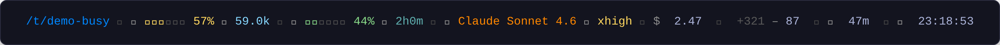

<div align="center">


**A fast, themeable statusline for Claude Code.**

Your working directory, git state, context usage, and live rate-limit countdowns — right in the Claude Code status line.

**[▶ See it in action](https://micschr0.github.io/claudebar/)** — demo video, all 16 themes, one-command install.

[](https://github.com/micschr0/claudebar/actions/workflows/rust.yml)
[](LICENSE)


</div>

<div align="center">


<br>



<br>
<sub><i>Full power — all 14 segments active.</i></sub>
<br>

## Features

- Live rate-limit countdowns with burn-rate projection
- Color-coded context usage
- Inline git state, stash count, and project name
- `clock_mode = "auto"` — detects 12h/24h and your local timezone
- 14 segments: 6 on by default, 8 more to opt into
- 16 themes · 6 styles
- [Renders in ~30 ms](scripts/benchmark.sh) — the bash script takes ~200 ms
- Read-only — never touches your session
- Tiny ~1.5 MB dependency-free binary

### Opt-in segments

Enable any of these in `~/.config/claudebar/config.toml` (or toggle via `claudebar config`):

| Segment | kebab-case key | What it shows |
|---------|---------------|---------------|
| Effort   | `effort`       | Reasoning effort level (`low`–`max`) |
| Clock    | `clock`        | Current time — 12h/24h/auto with timezone |
| Cost     | `cost`         | Session cost in USD |
| Lines    | `lines`        | Added/removed lines this session (`+321 −87`) |
| Duration | `duration`     | Session wall-clock time (`⧖ 47m`) |
| Stash    | `stash`        | Git stash count |
| Project  | `project`      | Repo-root name (stable across worktrees) |
| Burn     | `burn`         | Projected time until a rate-limit window runs dry |


<sub><i>claudebar living at the bottom of a Claude Code session.</i></sub>

</div>


## Install

**Prerequisites**

- A [Nerd Font](https://www.nerdfonts.com/) set as your terminal font — for the glyphs
- `git` — for the git segment (optional; the segment hides without it)
- `jq` — only if you already have a `~/.claude/settings.json` to merge into

```bash
curl -fsSL https://raw.githubusercontent.com/micschr0/claudebar/main/install.sh | bash
```

It installs the binary and wires up `~/.claude/settings.json` (backing up any existing file). Then **restart Claude Code** — the statusline appears on your next turn.

**Where it hooks in:** Claude Code reads the `statusLine` key in `~/.claude/settings.json`. The installer adds this for you:

```json
{
  "statusLine": { "type": "command", "command": "~/.claude/claudebar render" }
}
```

On every turn Claude Code runs that command, feeds it the session JSON on stdin, and prints whatever it writes to stdout as your statusline. (`cargo install` users use the bare `claudebar render`; the bash fallback uses `bash ~/.claude/statusline-command.sh`.)

<details>
<summary>Manual install</summary>

**Prebuilt binary:** download the latest release for your platform from the [releases page](https://github.com/micschr0/claudebar/releases), extract, and place `claudebar` on your `$PATH` or at `~/.claude/claudebar`.

**Build with cargo:**

```bash
cargo install --git https://github.com/micschr0/claudebar
```

`cargo install` places the binary on your `PATH` (`~/.cargo/bin`), so add it with the bare command:

```json
{
  "statusLine": { "type": "command", "command": "claudebar render" }
}
```

The curl installer instead installs to `~/.claude/claudebar` and writes that full path automatically. For the bash fallback, point the command at `bash ~/.claude/statusline-command.sh` instead.

</details>

## Configure

Once installed, launch the configurator — the simplest way; no extra app or flags needed:

```bash
claudebar config
```

Toggle and reorder segments, pick a theme and style, and nudge thresholds — all with a live render preview. It saves changes to `~/.config/claudebar/config.toml`. Inside, press `?` for key bindings, `s` to save, `q` to quit.

> If you installed with the curl script, the binary lives at `~/.claude/claudebar`, so call `~/.claude/claudebar config` (or add `~/.claude` to your `PATH`).


Prefer editing by hand? The config is plain TOML:

```toml
theme = "tokyo-night"
style = "powerline"
segments = ["directory", "git", "context", "rate-limits", "dev-context", "model"]

[thresholds]
warn           = 50   # bar turns yellow at this %
crit           = 80   # bar turns red at this %
weekly_show_at = 50   # weekly window shows at this % and above
clock_mode     = "auto"   # "auto" detects 12h/24h and timezone; "12h" / "24h" / "off" override
```

Run `claudebar list` to see all built-in themes and styles. The `--theme`, `--style`, and `--config` flags override the file for a single invocation.

## CLI

| Command | What it does |
|---------|--------------|
| `claudebar` / `claudebar render` | Read session JSON from stdin, write the ANSI line to stdout |
| `claudebar config` | Launch the interactive TUI configurator |
| `claudebar init [--print] [--force]` | Write a default config file |
| `claudebar migrate` | Add new segments from a newer version to an existing config |
| `claudebar list [--segments]` | List built-in themes and styles; `--segments` lists all segments |
| `claudebar test` | Render a built-in fixture to verify the install works |
| `claudebar doctor` | Diagnose common issues: Nerd Font, git, config parse errors |
| `claudebar edit` | Open your config file in `$EDITOR` (falls back to `vi`) |

## Build from source

```bash
cargo build --release                       # binary at target/release/claudebar
cargo install --path .                       # install to ~/.cargo/bin
cargo build --release --no-default-features  # render-only, no TUI (smaller)
```

## Troubleshooting

| **Something seems wrong** | Run `claudebar doctor` first — it checks your setup and suggests fixes. |
| **Install verification** | Run `claudebar test` — renders a fixture so you can confirm everything works before restarting Claude Code. |
| Symptom | Fix |
|---------|-----|
| **Statusline is blank** | Check `~/.claude/settings.json` has `"statusLine": {"type": "command", ...}`, then restart Claude Code. |
| **Glyphs show as boxes (□)** | Install a [Nerd Font](https://www.nerdfonts.com/). macOS Terminal.app can't render Nerd Font PUA glyphs — use iTerm2, Kitty, WezTerm, Ghostty, or Alacritty. |
| **Git segment missing** | Appears only inside a git repo; needs `git` on your `PATH`. |
| **Rate-limit windows missing** | Pro/Max plans only; the weekly window appears only when weekly usage meets or exceeds `weekly_show_at` (default 50%). |
| **`command not found: claudebar`** | The curl installer places the binary at `~/.claude/claudebar`; `cargo install` places it in `~/.cargo/bin`. Use the full path in `settings.json`, or ensure that directory is on your `PATH`. |

## License

[MIT](LICENSE)
