# claudebar

[](https://github.com/micschr0/claudebar/actions/workflows/rust.yml)

A statusline for Claude Code — context usage, rate limits, git state, and model info on every turn.



**Requirements:**
- [Nerd Font](https://www.nerdfonts.com/) — for the Powerline separator and status icon glyphs
- [git](https://git-scm.com/) — reads branch, ahead/behind, and modified-file counts

## Install

```bash
curl -fsSL https://raw.githubusercontent.com/micschr0/claudebar/main/install.sh | bash
```

Restart Claude Code. If the claudebar is blank, verify `~/.claude/settings.json` contains `"statusLine": {"type": "command", ...}`. If glyphs show as boxes, install a Nerd Font — macOS Terminal does not support Nerd Font PUA glyphs, use iTerm2, Kitty, WezTerm, Ghostty, or Alacritty.

The installer tries three methods in order: (1) downloads a prebuilt binary from GitHub Releases (verified by SHA256), (2) builds from source with `cargo` if run from a local checkout, (3) falls back to a standalone bash script. The bash fallback requires [jq](https://jqlang.org/).

<details>
<summary>Manual install</summary>

**Prebuilt binary:**

Download the latest release for your platform from the [releases page](https://github.com/micschr0/claudebar/releases), extract, and place `claudebar` on your `$PATH` or at `~/.claude/claudebar`.

**Rust binary (build from source):**

```bash
cargo install --git https://github.com/micschr0/claudebar
```

Add to `~/.claude/settings.json`:

```json
{
  "statusLine": {
    "type": "command",
    "command": "claudebar render"
  }
}
```

**Bash fallback** (no Rust toolchain needed, requires `jq`):

```bash
curl -fsSL https://raw.githubusercontent.com/micschr0/claudebar/main/statusline-command.sh \
  > ~/.claude/statusline-command.sh
chmod +x ~/.claude/statusline-command.sh
```

```json
{
  "statusLine": {
    "type": "command",
    "command": "bash ~/.claude/statusline-command.sh"
  }
}
```

</details>

## Updates

Re-run the install command. Updates take effect on the next turn.

## Configure

```bash
claudebar config      # interactive TUI configurator
```

The TUI lets you toggle and reorder segments, pick a theme and rendering style, and nudge the warning/critical thresholds. Changes are saved to `~/.config/claudebar/config.toml`.

| Key | Action |
|-----|--------|
| `j` / `k` or ↑↓ | Move cursor |
| `Tab` / `Shift-Tab` | Jump to next/previous section |
| `1`–`4` | Jump to section by number |
| `Space` | Toggle segment on/off |
| `m` | Enter reorder mode |
| `h` / `l` or ←→ | Nudge threshold ±1 |
| `H` / `L` | Nudge threshold ±5 |
| `s` | Save · `r` Reset to defaults · `?` Help · `q` Quit |

### Segments

| Segment | TOML key | What it shows |
|---------|----------|---------------|
| Directory | `directory` | Fish-style abbreviated path |
| Git | `git` | Branch name, ahead/behind, modified-file count |
| Context | `context` | Context usage bar and token count |
| Rate limits | `rate-limits` | 5-hour and weekly rate-limit windows with countdown |
| Dev context | `dev-context` | Dev context bar |
| Model | `model` | Model name and effort level |

Toggle segments with `claudebar config` or edit the `segments` list in `config.toml`.

### Themes and styles

- **Themes (16):** `tokyo-night` (default) · `ayu-mirage` · `catppuccin` · `cobalt2` · `everforest-dark` · `github-dark` · `gruvbox` · `kanagawa-wave` · `moonfly` · `night-owl` · `nord` · `one-dark` · `dracula` · `rose-pine` · `sonokai` · `solarized-dark`
- **Styles (6):** `powerline` (default) · `plain` · `rounded` · `minimal` · `unicode` · `ascii`

### Config file

TOML at `~/.config/claudebar/config.toml` (`$XDG_CONFIG_HOME/claudebar/config.toml` when set).

```toml
theme = "tokyo-night"
style = "powerline"
segments = ["directory", "git", "context", "rate-limits", "dev-context", "model"]

[thresholds]
warn           = 50   # bar turns yellow at this %
crit           = 80   # bar turns red at this %
weekly_show_at = 50   # show weekly rate-limit only above this %
bar_width      = 6    # bar width in terminal cells
```

Global flags `--theme`, `--style`, and `--config` override the file for a single invocation.

### All subcommands

| Command | What it does |
|---------|--------------|
| `claudebar` / `claudebar render` | Read session JSON from stdin, write ANSI status line to stdout |
| `claudebar config` | Launch the interactive TUI configurator |
| `claudebar init [--print] [--force]` | Write a default config file |
| `claudebar list` | Print all built-in theme and style names |

## Build from source

```bash
cargo build --release          # binary at target/release/claudebar
cargo install --path .         # install to ~/.cargo/bin/claudebar
```

To build without the TUI configurator (render-only, smaller binary):

```bash
cargo build --release --no-default-features
```

## Screenshots

**Calm** — low context and rate-limit usage, everything green:


**Normal** — context, 5-hour rate limit, and git state, working along:


**Critical** — context filling up, 5-hour limit tight, weekly window now shown:


**Over limit** — past 100% context, both bars red:


**Outside a git repo** — the git segment simply drops out:


**Model without an effort parameter** — the effort indicator drops out:


<details>
<summary>Easter egg</summary>


</details>

## License

[MIT](LICENSE)
