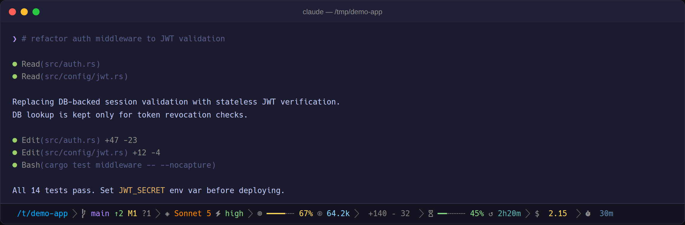
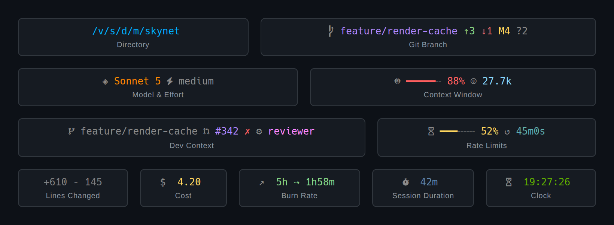
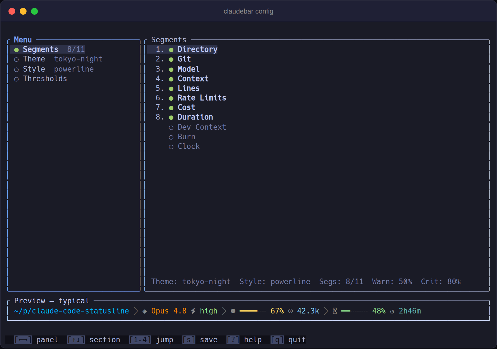
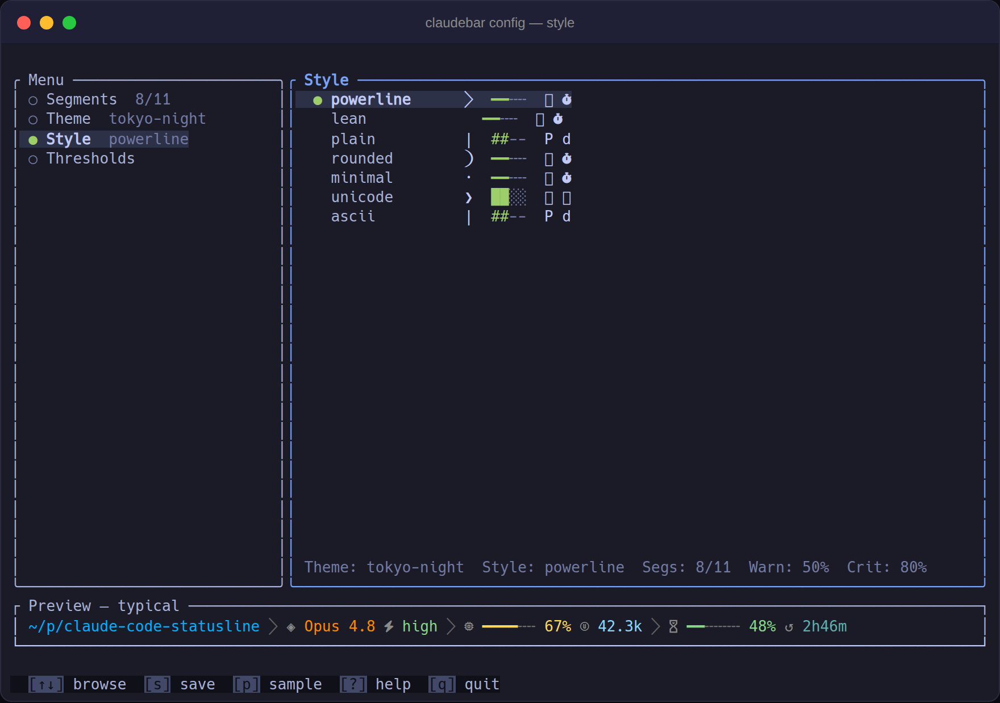

<div align="center">


**A powerline statusline for Claude Code: segments, themes, and a live TUI configurator in a single native binary.**

[](https://github.com/micschr0/claudebar/actions/workflows/rust.yml) [](https://github.com/micschr0/claudebar/releases/latest) [](https://github.com/micschr0/claudebar/releases) [](https://github.com/micschr0/claudebar/actions/workflows/security.yml) [](SECURITY.md#verifying-a-release) [](CLAUDE.md) [](Cargo.toml) [](LICENSE)

**[Documentation & live demo](https://micschr0.github.io/claudebar/)**

</div>



## Install

> [!NOTE]
> Powerline glyphs need a [Nerd Font](https://www.nerdfonts.com/), or switch to the `ascii` style.
> On macOS: `brew install --cask font-hack-nerd-font` (the font used in the screenshots).

```bash
curl -fsSL https://raw.githubusercontent.com/micschr0/claudebar/main/install.sh | bash
```

**Homebrew**
```bash
brew install micschr0/tap/claudebar && claudebar setup
```

<details><summary>Review the script first</summary>

```bash
curl -fsSL https://raw.githubusercontent.com/micschr0/claudebar/main/install.sh -o install.sh
claude -p "Audit this script for anything unsafe, then summarize what it does" < install.sh
bash install.sh
```
</details>

## What it looks like

Colors shift as usage crosses **50%** and **80%**:


All segments — three off by default (dev-context, burn, clock):



## Configure

```bash
claudebar config
```

Full-screen TUI: live preview, theme and style pickers, threshold sliders. `?` for keys, `s` saves, `q` quits.





Or edit the TOML at `~/.config/claudebar/config.toml` directly (`claudebar edit`):

```toml
theme = "tokyo-night"
style = "powerline"
segments = ["directory", "git", "model", "context", "lines", "rate-limits", "cost", "duration"]

[thresholds]
warn = 50   # bar turns yellow
crit = 80   # bar turns red
```

## CLI reference

| Command | Action |
|---|---|
| `claudebar` / `claudebar render` | Read session JSON from stdin, write ANSI statusline to stdout |
| `claudebar config` | Launch the TUI configurator |
| `claudebar setup` | Wire claudebar into Claude Code's `settings.json` |
| `claudebar list` | List built-in themes and styles |
| `claudebar doctor` | Diagnose font, git, config, and PATH issues |

More commands and flags: `claudebar --help`.

## Uninstall

```bash
brew uninstall claudebar
# or: rm ~/.claude/claudebar   # script install
```

Then remove the `statusLine` entry from `~/.claude/settings.json` and, optionally, `~/.config/claudebar/`.

---

**More:** [documentation & live demo](https://micschr0.github.io/claudebar/) · [build from source](https://micschr0.github.io/claudebar/#build) · [contributing](CONTRIBUTING.md) · [contributing a theme](CONTRIBUTING-themes.md) · [changelog](CHANGELOG.md) · [verifying releases](SECURITY.md#verifying-a-release) · [report an issue](https://github.com/micschr0/claudebar/issues)

## License

[MIT](LICENSE)
