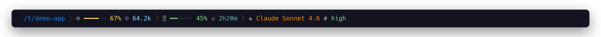
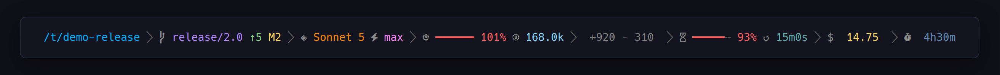

<div align="center">


### Your Claude Code session, at a glance — before it surprises you.

Context budget running hot? Rate limit about to reset? Session cost climbing?
**claudebar** puts it all in one line — color-coded, always visible, never in your way.

[▶ See it in action](https://micschr0.github.io/claudebar/)

[](https://github.com/micschr0/claudebar/actions/workflows/rust.yml)
[](LICENSE)


<sub>claudebar living at the bottom of a Claude Code session.</sub>

</div>

## Install

**Prerequisites:** A [Nerd Font](https://www.nerdfonts.com/) (or use the `ascii` / `unicode` style) · `git` on your `PATH` (optional; the git segment hides without it)

```bash
curl -fsSL https://raw.githubusercontent.com/micschr0/claudebar/main/install.sh | bash
```

Then **restart Claude Code** — the statusline appears on your next turn.

**Verify your install:**

```bash
claudebar smoke    # renders a test fixture — if you see a styled line, it works
claudebar doctor   # checks fonts, git, config — tells you what's missing
```

> 💡 The curl installer places the binary at `~/.claude/claudebar`. For `cargo install`, see [Build from source](#build-from-source).

## Features

### 8 core segments — always on

| Segment | What it shows |
|---------|---------------|
| **Directory** | Current working directory (abbreviated with `~` for `$HOME`) |
| **Git** | Branch, ahead/behind, modified + untracked files |
| **Model** | Active Claude model with inline reasoning effort |
| **Context** | Context-window gauge with token counts |
| **Lines** | Lines added and removed this session (`+321 −87`) |
| **Rate Limits** | 5-hour + 7-day rate-limit countdowns with color-coded bars |
| **Cost** | Session cost in USD |
| **Duration** | Session wall-clock time |

### 4 opt-in segments

Enable any of these in `~/.config/claudebar/config.toml` or toggle via `claudebar config`:

| Segment | kebab-case key | What it shows |
|---------|---------------|---------------|
| Dev Context | `dev-context` | Current development context name (worktree, PR, agent) |
| Stash | `stash` | Git stash count |
| Burn | `burn` | Projected time until a rate-limit window runs dry — with 5 urgency levels |
| Clock | `clock` | Current time — 12h/24h auto-detected with timezone |
- **Live rate-limit countdowns** with burn-rate projection (green → yellow → red as windows fill)
- **Responsive auto-wrap layout** — set `layout = "auto"` and the bar flows across up to 3 lines on narrow terminals
- **Plain-text float companion** — write a segment summary to a file for tmux, menu bars, or scripting
- **16 themes · 7 styles** (powerline, lean, plain, rounded, minimal, unicode, ascii)
- **Renders in ~30 ms** — ~5× faster than the bash fallback, cold start included
- **Read-only** — never touches your Claude Code session
- **1.5 MB binary** — no runtime dependencies

### Bash fallback vs claudebar

| | bash script | claudebar |
|---|:---:|:---:|
| Render time | ~200 ms | ~30 ms |
| Themes | — | 16 |
| TUI configurator | — | ✓ |
| Segments | 6 | 14 |
| Burn-rate projection | — | ✓ |
| Responsive layout | — | ✓ |
| Segments | 6 | 12 |

## Screenshots


<sub>Normal session — moderate context usage, rate limits in the green.</sub>

<br>


<sub>Trouble brewing — context near capacity, 5h window running hot.</sub>

<br>


<sub>Over limit — both windows past threshold, burn projection shows time-to-empty.</sub>

<br>


<sub>Outside a git repo — git-related segments drop out cleanly.</sub>

## Configure

```bash
claudebar config
```

Launch the interactive TUI configurator — toggle and reorder segments, preview themes and styles live, and nudge thresholds. Press `?` for key bindings, `s` to save, `q` to quit.


Prefer editing by hand? The config is plain TOML at `~/.config/claudebar/config.toml`:

```toml
theme = "tokyo-night"
style = "powerline"
segments = ["directory", "git", "model", "context", "lines", "rate-limits", "cost", "duration"]

[thresholds]
warn           = 50    # bar turns yellow at this %
crit           = 80    # bar turns red at this %
weekly_show_at = 75    # weekly window shown at this % and above
bar_width      = 6     # width of progress bars in cells
clock_mode     = "auto"   # "auto" detects 12h/24h; "12h" / "24h" / "off"
clock_seconds  = true
layout         = "fixed"  # "fixed" = single line, "auto" = responsive wrap
max_lines      = 3     # auto mode: max wrap lines
wrap_margin    = 4     # auto mode: right-hand margin
cost_decimals  = 2
name_max       = 0     # 0 = don't truncate names
burn_lookback  = 600   # seconds of history for burn-rate projection
model_show_effort = true
limit_sync     = false
float          = false

## CLI

| Command | What it does |
|---------|--------------|
| `claudebar` / `claudebar render` | Read session JSON from stdin, write the ANSI line to stdout |
| `claudebar config` | Launch the interactive TUI configurator |
| `claudebar init [--print] [--force]` | Write a default config file |
| `claudebar sync` | Add new segments from a newer version to an existing config |
| `claudebar list [--segments]` | List built-in themes and styles; `--segments` lists all segments |
| `claudebar smoke` | Render a built-in fixture to verify the install works |
| `claudebar doctor` | Diagnose common issues: Nerd Font, git, config parse errors |
| `claudebar edit` | Open your config file in `$EDITOR` (falls back to `vi`) |
| `claudebar completions <SHELL>` | Generate shell completions (bash, zsh, fish) |

Global flags: `--theme <NAME>`, `--style <NAME>`, `--segments <LIST>`, `--config <FILE>` override the config file for a single invocation.

## Build from source

```bash
cargo build --release                       # binary at target/release/claudebar
cargo install --path .                       # install to ~/.cargo/bin
cargo build --release --no-default-features  # render-only, no TUI (smaller)
```

## Troubleshooting

| Symptom | Fix |
|---------|-----|
| **Statusline is blank** | Check `~/.claude/settings.json` has `"statusLine": {"type": "command", ...}`, then restart Claude Code. |
| **Glyphs show as boxes (□)** | Install a [Nerd Font](https://www.nerdfonts.com/) or switch to the `ascii` or `unicode` style. macOS Terminal.app can't render Nerd Font PUA glyphs — use iTerm2, Kitty, WezTerm, Ghostty, or Alacritty. |
| **Git segment missing** | Appears only inside a git repo; needs `git` on your `PATH`. |
| **Rate-limit windows missing** | Pro/Max plans only; the weekly window appears only when weekly usage meets or exceeds `weekly_show_at` (default 50%). |
| **`command not found: claudebar`** | The curl installer places the binary at `~/.claude/claudebar`; `cargo install` places it in `~/.cargo/bin`. Use the full path in `settings.json`, or ensure the directory is on your `PATH`. |

> **Something seems wrong?** Run `claudebar doctor` first — it checks your setup and suggests fixes.
> **Install verification:** Run `claudebar smoke` — renders a fixture so you can confirm everything works.

## License

[MIT](LICENSE)
