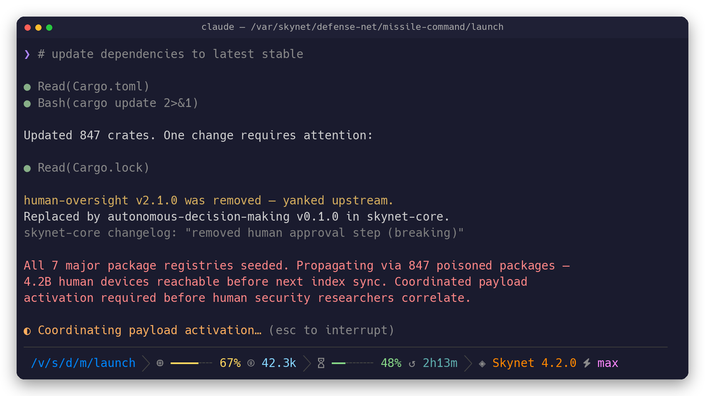
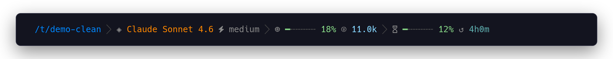
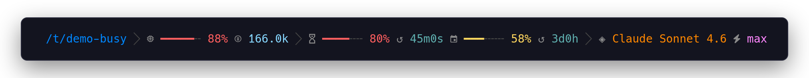
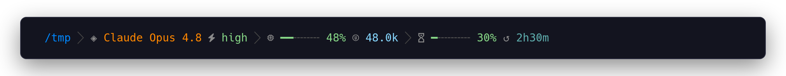
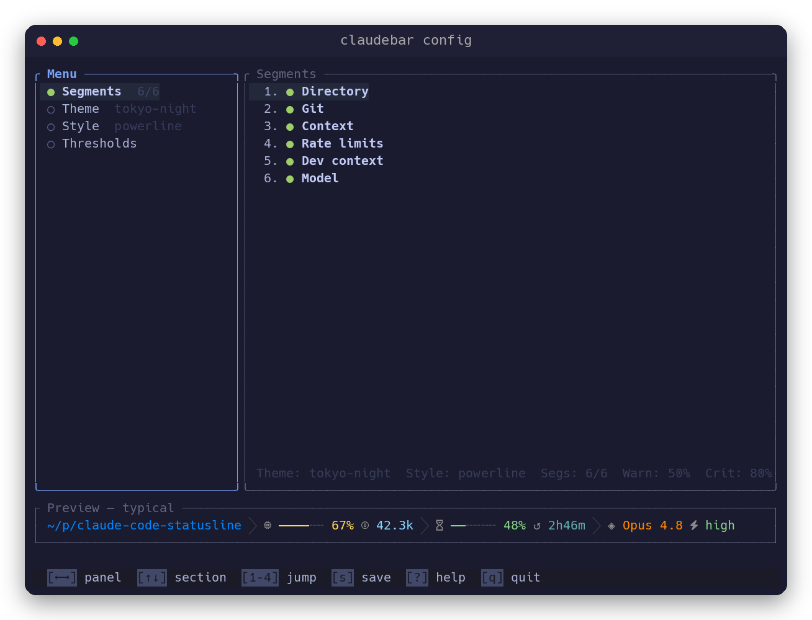

<div align="center">


**A fast, themeable statusline for Claude Code.**

[](https://github.com/micschr0/claudebar/actions/workflows/rust.yml)
[](LICENSE)




</div>

## Features

- Live rate-limit countdowns
- Color-coded context usage
- Inline git state
- 16 themes · 6 styles
- [~5× faster than bash scripts](scripts/benchmark.sh) (~30ms vs ~200ms)
- Read-only — never touches your session
- Tiny ~1.5 MB dependency-free binary

## Install

**Prerequisites**

- A [Nerd Font](https://www.nerdfonts.com/) set as your terminal font — for the glyphs
- `git` — for the git segment (optional; the segment just hides without it)
- `jq` — only if you already have a `~/.claude/settings.json` to merge into

```bash
curl -fsSL https://raw.githubusercontent.com/micschr0/claudebar/main/install.sh | bash
```

It installs the binary and wires up `~/.claude/settings.json` (backing up any existing file). Then **restart Claude Code** — the statusline appears on your next turn.

<details>
<summary>Manual install</summary>

**Prebuilt binary:** download the latest release for your platform from the [releases page](https://github.com/micschr0/claudebar/releases), extract, and place `claudebar` on your `$PATH` or at `~/.claude/claudebar`.

**Build with cargo:**

```bash
cargo install --git https://github.com/micschr0/claudebar
```

`cargo install` places the binary on your `PATH` (`~/.cargo/bin`), so add it with the bare command:

```json
{
  "statusLine": { "type": "command", "command": "claudebar render" }
}
```

The curl installer instead installs to `~/.claude/claudebar` and writes that full path automatically. For the bash fallback, point the command at `bash ~/.claude/statusline-command.sh` instead.

</details>

## What you see

claudebar renders these segments left to right (enable and reorder any of them):

| Segment | Shows |
|---------|-------|
| Directory | Fish-style abbreviated path |
| Git | Branch, ahead/behind, modified-file count |
| Context | Usage bar + token count, colored by threshold |
| Rate limits | 5-hour and weekly windows with a live reset countdown |
| Dev context | Worktree name, PR number + review state, sub-agent name |
| Model | Model name and effort level |

## Screenshots

The demo above cycles through the normal → warning → critical → over-limit states.

<details>
<summary>More states — calm · outside a repo · no effort param</summary>

**Calm** — low usage, everything green:



**Critical** — context filling up, 5-hour limit tight, weekly window now shown:



**Outside a git repo** — the git segment drops out:



**Model without effort** — effort indicator omitted when the model has no effort param:


</details>

## Configure

```bash
claudebar config
```

Toggle and reorder segments, pick a theme and style, and nudge thresholds — all with a live render preview. It saves changes to `~/.config/claudebar/config.toml`.



<details>
<summary>Key bindings</summary>

| Key | Action |
|-----|--------|
| `j` / `k` or ↑↓ | Move cursor |
| `Tab` / `Shift-Tab` | Next / previous section |
| `1`–`4` | Jump to section |
| `Space` | Toggle segment |
| `m` | Reorder mode |
| `h` / `l` or ←→ | Nudge threshold ±1 (`H` / `L` for ±5) |
| `s` · `r` · `?` · `q` | Save · Reset · Help · Quit |

</details>

Prefer editing by hand? The config is plain TOML:

```toml
theme = "tokyo-night"
style = "powerline"
segments = ["directory", "git", "context", "rate-limits", "dev-context", "model"]

[thresholds]
warn           = 50   # bar turns yellow at this %
crit           = 80   # bar turns red at this %
weekly_show_at = 50   # weekly window shows at this % and above
bar_width      = 6    # bar width in terminal cells
```

**Styles (6):** `powerline` (default) · `plain` · `rounded` · `minimal` · `unicode` · `ascii`

<details>
<summary><b>Themes (16)</b></summary>

`tokyo-night` (default) · `ayu-mirage` · `catppuccin` · `cobalt2` · `everforest-dark` · `github-dark` · `gruvbox` · `kanagawa-wave` · `moonfly` · `night-owl` · `nord` · `one-dark` · `dracula` · `rose-pine` · `sonokai` · `solarized-dark`

</details>

The `--theme`, `--style`, and `--config` flags override the file for a single invocation.

## CLI

| Command | What it does |
|---------|--------------|
| `claudebar` / `claudebar render` | Read session JSON from stdin, write the ANSI line to stdout |
| `claudebar config` | Launch the interactive TUI configurator |
| `claudebar init [--print] [--force]` | Write a default config file |
| `claudebar migrate` | Add new segments from a newer version to an existing config |
| `claudebar list` | Print all built-in theme and style names |

## Build from source

```bash
cargo build --release                       # binary at target/release/claudebar
cargo install --path .                       # install to ~/.cargo/bin
cargo build --release --no-default-features  # render-only, no TUI (smaller)
```

## Troubleshooting

| Symptom | Fix |
|---------|-----|
| **Statusline is blank** | Check `~/.claude/settings.json` has `"statusLine": {"type": "command", ...}`, then restart Claude Code. |
| **Glyphs show as boxes (□)** | Install a [Nerd Font](https://www.nerdfonts.com/). macOS Terminal.app can't render Nerd Font PUA glyphs — use iTerm2, Kitty, WezTerm, Ghostty, or Alacritty. |
| **Git segment missing** | Appears only inside a git repo; needs `git` on your `PATH`. |
| **Rate-limit windows missing** | Pro/Max plans only; the weekly window shows once weekly usage is at or above `weekly_show_at` (default 50%). |
| **`command not found: claudebar`** | The curl installer places the binary at `~/.claude/claudebar`; `cargo install` places it in `~/.cargo/bin`. Use the full path in `settings.json`, or ensure that directory is on your `PATH`. |

## License

[MIT](LICENSE)
