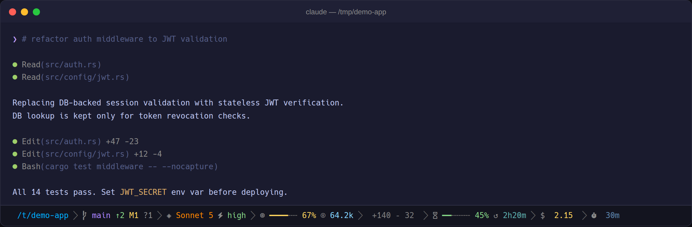
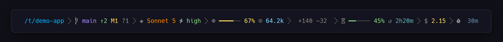
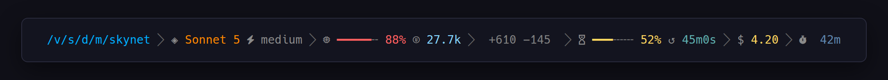
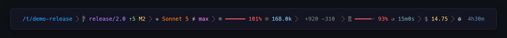
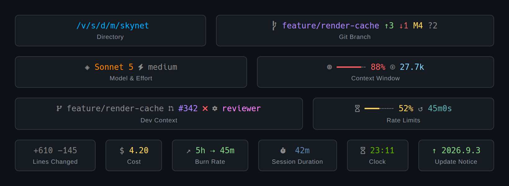
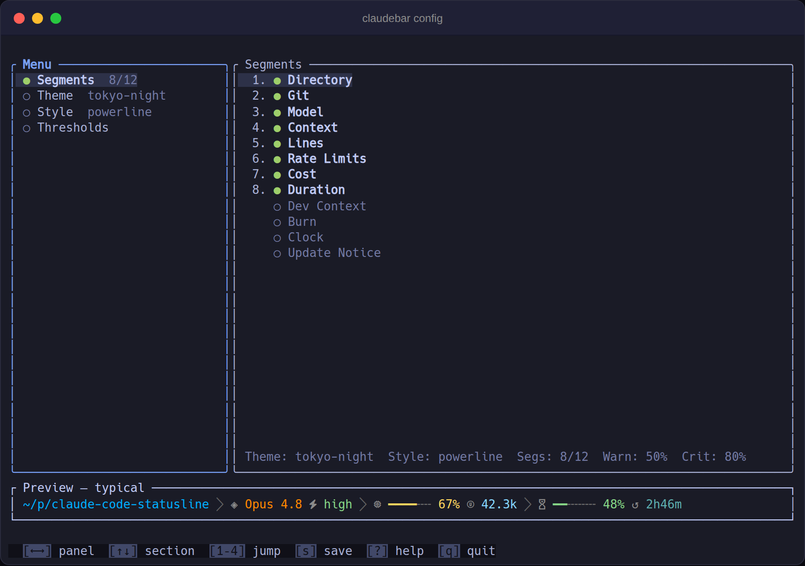
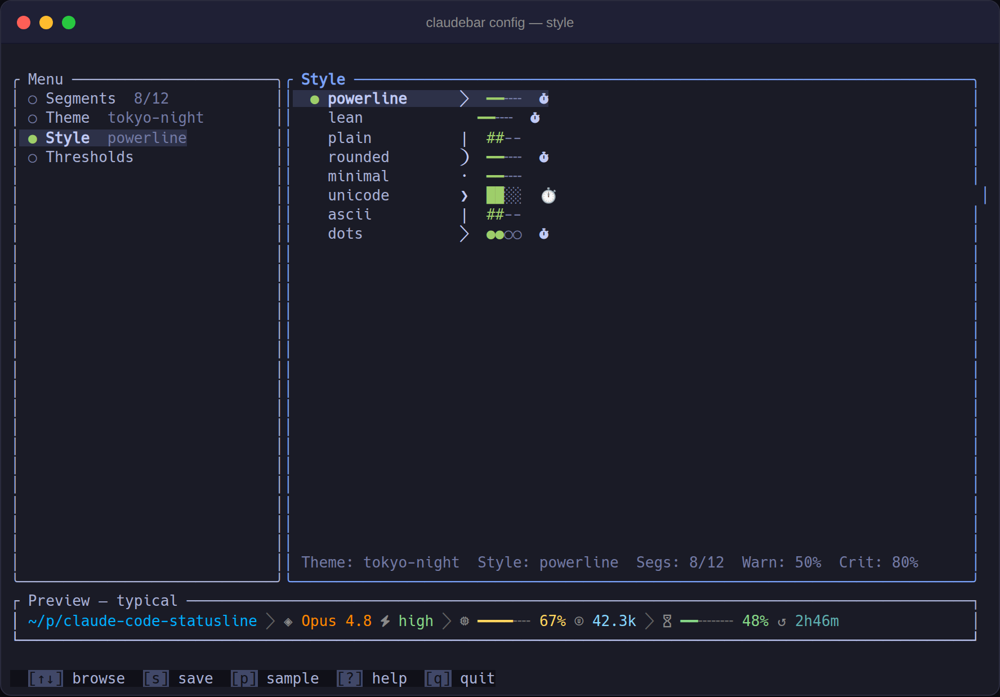

<div align="center">


**A powerline statusline for Claude Code: segments, themes, and a live TUI configurator in a single native binary.**

[](https://github.com/micschr0/claudebar/actions/workflows/rust.yml) [](https://github.com/micschr0/claudebar/releases/latest) [](https://github.com/micschr0/claudebar/releases) [](https://github.com/micschr0/claudebar/actions/workflows/security.yml) [](SECURITY.md#verifying-a-release) [](CLAUDE.md) [](Cargo.toml) [](LICENSE)

**[Documentation & live demo](https://micschr0.github.io/claudebar/)**

</div>



## Install

> [!NOTE]
> Powerline glyphs need a [Nerd Font](https://www.nerdfonts.com/), or switch to the `ascii` style.
> On macOS: `brew install --cask font-hack-nerd-font` (the font used in the screenshots).

```bash
# verifies SHA256, plus build provenance when gh is available
curl -fsSL https://raw.githubusercontent.com/micschr0/claudebar/main/install.sh | bash
```

**Homebrew**
```bash
# verifies SHA256
brew install micschr0/tap/claudebar
```

**mise**
```bash
# verifies SHA256 and build provenance automatically
mise use -g github:micschr0/claudebar
```

**pnpm**
```bash
# same per-platform package, installable with any npm-registry package manager
pnpm add -g @micschr0/claudebar
```

Then wire it into Claude Code. It shows a diff, asks before writing, and backs up the old file:

```bash
claudebar setup
```

<details><summary>What each install method verifies</summary>

Every method checks the SHA256 of the downloaded archive. Only some also verify [build provenance](https://docs.github.com/en/actions/security-guides/using-artifact-attestations-to-establish-provenance-for-builds), which proves that this repo's `release.yml` built the binary. A matching hash on its own does not.

| Method | SHA256 | Build provenance |
|---|---|---|
| `install.sh` | ✓ fatal on mismatch | ~ needs `gh`, authenticated |
| Homebrew | ✓ | ✗ |
| `mise` | ✓ | ✓ automatic |
| npm / pnpm | ✓ (ships verified binary) | ✗ |
| `claudebar-installer.sh` (hosted) | ✓ | ✗ |

<sub>✓ verified, ~ conditional, ✗ not checked</sub>

> [!NOTE]
> The npm/pnpm packages ship the **already-attested** release binaries (built and
> provenance-signed by `release.yml`, then repackaged unchanged). The package itself
> carries no [npm registry provenance](https://docs.npmjs.com/generating-provenance-statements/),
> since that would attest the repackaging workflow rather than the build. What
> `install.sh` checks is the `release.yml` provenance on the binaries themselves.

`install.sh` treats a checksum mismatch as fatal; a provenance error only warns. It scopes trust to `release.yml` via `gh attestation verify --signer-workflow`. To verify a download by hand:

```bash
gh attestation verify claudebar-x86_64-unknown-linux-musl.tar.gz \
  --repo micschr0/claudebar \
  --signer-workflow micschr0/claudebar/.github/workflows/release.yml
```
</details>

<details><summary>Review the script first</summary>

```bash
curl -fsSL https://raw.githubusercontent.com/micschr0/claudebar/main/install.sh -o install.sh
claude -p "Audit this script for anything unsafe, then summarize what it does" < install.sh
bash install.sh
```
</details>

<details><summary>Beta channel</summary>

Prereleases (tagged e.g. `2026.7.6-beta.1`) ship to a separate Homebrew formula, so `brew upgrade` keeps stable users on stable:

```bash
brew install micschr0/tap/claudebar-beta
```

Or via the script:

```bash
curl -fsSL https://raw.githubusercontent.com/micschr0/claudebar/main/install.sh | CLAUDEBAR_CHANNEL=beta bash
```

`micschr0/tap/claudebar` always tracks stable; `claudebar-beta` follows the latest prerelease. Back to stable:

```bash
brew uninstall micschr0/tap/claudebar-beta && brew install micschr0/tap/claudebar
```
</details>

## What it looks like

Colors shift as usage crosses **50%** and **80%**:







All segments. Four are off by default (dev-context, burn, clock, update-notice):



## Configure

```bash
claudebar config
```

Full-screen TUI: live preview, theme and style pickers, threshold sliders. `?` for keys, `s` saves, `q` quits.





Or edit the TOML at `~/.config/claudebar/config.toml` directly (`claudebar edit`):

```toml
theme = "tokyo-night"
style = "powerline"
segments = ["directory", "git", "model", "context", "lines", "rate-limits", "cost", "duration"]

[thresholds]
warn = 50   # bar turns yellow
crit = 80   # bar turns red
```

## CLI reference

| Command | Action |
|---|---|
| `claudebar` / `claudebar render` | Read session JSON from stdin, write ANSI statusline to stdout |
| `claudebar config` | Launch the TUI configurator |
| `claudebar setup` | Wire claudebar into Claude Code's `settings.json` |
| `claudebar list` | List built-in themes and styles |
| `claudebar doctor` | Diagnose font, git, config, and PATH issues |
| `claudebar update` | Check for a newer claudebar release (manual; never runs during rendering) |

More commands and flags: `claudebar --help`.

### Checking for updates

`claudebar update` compares your installed version against the newest GitHub
release. You run it yourself, and the render path never blocks on the network,
so the statusline cannot stall on it.

It compares against the newest **stable** release. Pass `--channel beta` to
include prereleases.

```bash
claudebar update
# claudebar 2026.8.15 (stable channel)
# Update available: 2026.8.16 (stable)
# Install/update: https://github.com/micschr0/claudebar#installation
```

Add the `update-notice` segment to see the result inline, as an "↑ 2026.8.20"
badge on the statusline. It is off by default and stays that way — `claudebar
sync`, which adds segments introduced by newer versions, deliberately skips this
one and only tells you it exists. Add it to `segments` yourself to enable it.

Enabling it opts into a background check, started at most once every 24 hours by
a detached child process that writes a small cache next to your config file. The
statusline itself only reads that cache and never waits for the check. With the
segment disabled the render path does no network or cache I/O at all; an
explicit `claudebar update` still writes the cache, since that is you asking for
a check.

Exit codes: `0` = up to date, `1` = check failed (e.g. no network), `2` = update
available. In `set -e` shells or `&&`-chains, where exit `2` reads as an error,
add `--check`: it still prints the result but exits `0` on success.

## Uninstall

```bash
brew uninstall claudebar
# or: rm ~/.claude/claudebar   # script install
# or: pnpm remove -g @micschr0/claudebar   # npm / pnpm install
```

Then remove the `statusLine` entry from `~/.claude/settings.json`, and `~/.config/claudebar/` if you want the config gone too.

---

**More:** [documentation & live demo](https://micschr0.github.io/claudebar/) · [build from source](https://micschr0.github.io/claudebar/#build) · [contributing](CONTRIBUTING.md) · [contributing a theme](CONTRIBUTING-themes.md) · [changelog](CHANGELOG.md) · [verifying releases](SECURITY.md#verifying-a-release) · [report an issue](https://github.com/micschr0/claudebar/issues)

## License

[MIT](LICENSE)