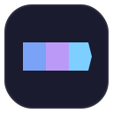
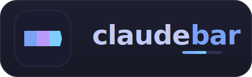
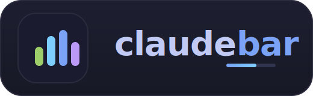
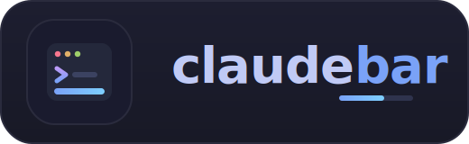
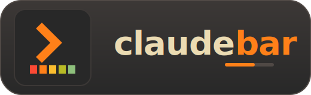
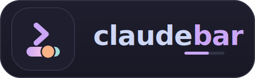
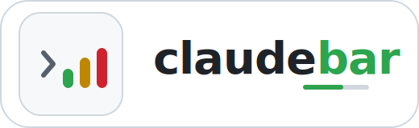

# claudebar logo variants

Five logo concepts, all built from the default **tokyo-night** palette
(`#1a1b2e` tile · `#7aa2f7` blue · `#bb9af7` purple · `#7dcfff` cyan).
Each comes as a square `vN-mark.svg` (app icon) and a `vN.svg` wordmark lockup,
with matching PNG rasters. Regenerate the SVGs with `scripts/gen_logos.py`.

| # | Concept | Mark | Lockup |
|---|---------|------|--------|
| 1 | Prompt chevron + statusline bar |  |  |
| 2 | Powerline segments (the literal statusline) |  |  |
| 3 | Equalizer / status bars |  |  |
| 4 | Context ring gauge + chevron |  |  |
| 5 | Terminal window with a statusline |  |  |

The marks are self-contained (dark tile) and the lockups sit on a dark panel, so
all variants stay legible on both light and dark README themes.

## Alternative directions (different palettes + styles)

Three concepts that drop the tokyo-night blue/purple for entirely different
colour worlds and visual styles, drawn from other themes seen in the
screenshots. Regenerate with `scripts/gen_logos_alt.py`.

| Name | Palette / style | Mark | Lockup |
|------|-----------------|------|--------|
| `warm` | Gruvbox — warm retro, boxy level-meter |  |  |
| `soft` | Catppuccin — soft pastel, rounded pill + knob |  |  |
| `light` | Status semaphore — flat, light, green→amber→red |  |  |

`warm` and `soft` are self-contained dark tiles/panels; `light` is a deliberately
light design (white tile, light panel) for a completely different mood.
