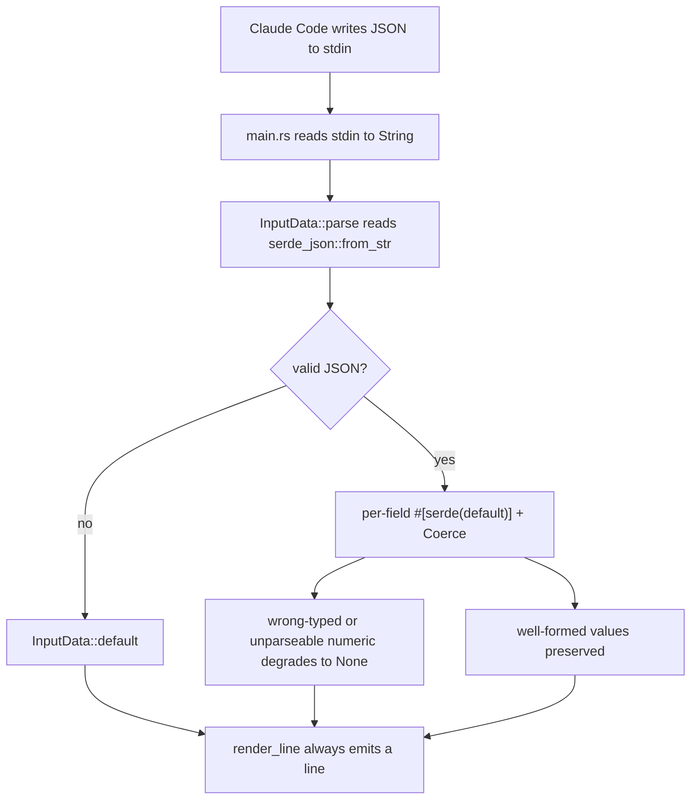

# Input parsing: forgiving Claude Code session JSON

`claudebar` is a hook that renders a status line from the JSON object Claude
Code writes to the hook's stdin. Because that payload is written by an external
process and can vary in shape, the parser is deliberately forgiving: it never
aborts a render because one field is missing, wrong-typed, or unparseable. A
malformed field degrades to `None` for *that field only*, and a line is always
produced.

## Responsibilities and entrypoint

The parsed shape and parsing entrypoint live in `src/model/input.rs`. The
module-level doc comment defines the core contract: every numeric field is
wrapped in `Coerce`, a forgiving deserializer mirroring jq's
`tonumber? // <default>`; combined with `#[serde(default)]` everywhere and a
top-level `unwrap_or_default()`, the render path always produces a line
([`src/model/input.rs` L1-L16](repo://src/model/input.rs#L1-L16)).

The single parse entrypoint is `InputData::parse(s: &str) -> Self`. It runs
`serde_json::from_str(s).unwrap_or_default()`, so even a fully invalid
JSON document (not just a bad field) returns `InputData::default()` rather than
erroring out of the hook logic ([`src/model/input.rs`
L147-L153](repo://src/model/input.rs#L147-L153)). `main.rs` reads stdin into a
`String` and calls this exactly once before rendering
([`src/main.rs` L94-L107](repo://src/main.rs#L94-L107)).

`InputData` is a flat aggregate of optional subgroups — `cwd`, `context_window`,
`rate_limits`, `model`, `effort`, `pr`, `worktree`, `workspace`, `agent`,
`cost`, and `output_style` — every field `#[serde(default)]` and independently
absent ([`src/model/input.rs` L22-L47](repo://src/model/input.rs#L22-L47)). The
module re-exports `InputData` as the shared crate contract that every segment,
theme, and style is written against, with no I/O or rendering of its own
([`src/model/mod.rs` L1-L12](repo://src/model/mod.rs#L1-L12)).

### Parsed-input fields are all Coerce-backed numbers

Every numeric field in the parsed shape is a `Coerce<T>` (see the next section),
so all of them — token totals, percentages, PR number, and the `cost` sub-object
— inherit the same forgiving degradation. Within `CostInfo`, alongside the
USD total and lines-added/removed counters, sits the session wall-clock
duration:

- `CostInfo.total_duration_ms: Coerce<u64>` — the parsed, forgivable session
  wall-clock duration in milliseconds
  ([`src/model/input.rs` L135-L137](repo://src/model/input.rs#L135-L137)).
  Because it is `Coerce<u64>`, a missing or wrong-typed `total_duration_ms`
  degrades to `None` under the identical forgiving contract as every other
  numeric field — it never aborts the parse.

It is consumed by the `Duration` segment in `src/segment/duration.rs`, which
reads `ctx.input.cost.total_duration_ms.0` and returns `false` (emitting
nothing) when the value is absent **or zero**
([`src/segment/duration.rs` L27-L43](repo://src/segment/duration.rs#L27-L43)).
When present, it formats the milliseconds as `⧖ 47m`, `⧖ 1h02m`, or `⧖ 42s`
(and `0s` for sub-second values), using the duration glyph from the active style
([`src/segment/duration.rs` L10-L24](repo://src/segment/duration.rs#L10-L24)).

## The `Coerce<T>` forgiving deserializer

`Coerce<T>` holds an `Option<T>`. Its custom `Deserialize` implementation
accepts a JSON number, a numeric string, or `null`, and turns any *other* type
(bool, array, object, unparseable string) into `None` rather than erroring
([`src/model/input.rs` L169-L179](repo://src/model/input.rs#L169-L179)). The
`Visitor` routes `visit_u64`/`visit_i64`/`visit_f64`/`visit_str` through
`FromJsonNumber`, treats `null`/absent as `None`, and returns `None` for bools,
sequences, and maps — including draining the ignored entries so parsing stays
well-formed ([`src/model/input.rs`
L277-L331](repo://src/model/input.rs#L277-L331)).

Two accessors expose the value: `or_default()` returns `T::default()` when the
field was absent or coerced, and `get()` returns the raw `Option<T>`
([`src/model/input.rs` L181-L195](repo://src/model/input.rs#L181-L195)).
Consumers pick which to use: the context segment totals tokens with
`or_default()` but reads the percentage with `get()` so it can branch on
presence ([`src/segment/context.rs` L29-L53](repo://src/segment/context.rs#L29-L53)).

### Range-checked numeric conversion

`FromJsonNumber` is implemented only for the types actually parsed (`u64`,
`i64`, `f64`) and does deliberate, range-checked f64→integer conversions
([`src/model/input.rs` L197-L204](repo://src/model/input.rs#L197-L204)). For
`u64` and `i64`, the float path uses strict inequalities against `2^64` and
`2^63` respectively, because `u64::MAX as f64` and `i64::MAX as f64` round up to
exactly those powers of two; a non-strict bound would wrongly admit the whole
rounding gap above the true max. The sign, truncation, and precision Clippy
lints are suppressed module-wide with an explanation of these range guards
([`src/model/input.rs` L206-L259](repo://src/model/input.rs#L206-L259)). `f64`
simply rejects non-finite values ([`src/model/input.rs`
L261-L275](repo://src/model/input.rs#L261-L275)).

These boundaries are exercised by dedicated unit tests: out-of-range strings,
`null`, wrong types, negative `i64`→`u64` conversion, `2^64`/`2^63` rejection,
and the largest f64 below `2^64` still being accepted
([`src/model/input.rs` L341-L477](repo://src/model/input.rs#L341-L477)).

## Control flow

## Rate limits and over-100 percentages are valid

Percentages are *not* clamped to 100 on purpose: a rate-limit window or the
context window can legitimately exceed 100 when you are over the limit. The
`used_percentage` fields on `ContextWindow` and both `Window` types are plain
`Coerce<f64>` with no upper-bound coercion, and the docs flag "can exceed 100"
([`src/model/input.rs` L49-L76](repo://src/model/input.rs#L49-L76)). The render
side then *clamps for display only*: both the context and rate-limit segments
clamp the percentage into `0..=999` (rejecting a leaked epoch timestamp while
still permitting over-limit values), and the context segment colors anything
above 100 as critical ([`src/segment/context.rs`
L34-L48](repo://src/segment/context.rs#L34-L48), [`src/segment/rate_limits.rs`
L37-L46](repo/src/segment/rate_limits.rs#L37-L46)). So parsing preserves the
real value; display logic decides how to render it.

The `Window` type also treats `resets_at` as Unix epoch **seconds**, parsed
through `Coerce<i64>`, which the reset-countdown logic consumes against the
injected `now` ([`src/model/input.rs` L68-L76](repo://src/model/input.rs#L68-L76)).

## Derived accessor: worktree name

The `worktree_name()` convenience method on `InputData` tries `worktree.name`
first and falls back to `workspace.git_worktree` when the primary worktree
object is absent ([`src/model/input.rs` L155-L166](repo://src/model/input.rs#L155-L166)).
The dev-context segment is the sole consumer, using it to decorate output with
the current worktree/PR context ([`src/segment/dev_context.rs`
L27-L30](repo/src/segment/dev_context.rs#L27-L30)).

## Representative fixture inputs

`fixtures/*.json` are representative stdin payloads, loaded via
`include_str!`/filesystem read and fed to `InputData::parse` by the golden
render tests and the TUI preview. The golden suite iterates **every** `*.json`
fixture under the default config with a fixed clock and `$HOME`, asserting
deterministic snapshots and proving no raw ESC from host strings leaks through
([`tests/render_golden.rs` L1-L36](repo://tests/render_golden.rs#L1-L36)). The
TUI preview cycles six of them so the preview is byte-identical to what the
<!-- openwiki: broken internal link [repo/src/tui/sample.rs#L14-L41] file "repo/src/tui/sample.rs" does not exist. Fix the href or restore the target, then delete this comment. -->
hook would emit ([`src/tui/sample.rs` L14-L41](repo/src/tui/sample.rs#L14-L41)).

| Fixture | What it exercises |
| --- | --- |
| `typical.json` | A representative well-formed session: `cwd`, context tokens at 67%, a 5-hour window at 48%, model `Opus 4.8`, effort `high`. Used by `golden_matrix`'s 16-theme × 2-style matrix and the `smoke`/`setup` preview ([`tests/render_golden.rs` L59-L73](repo://tests/render_golden.rs#L59-L73)). |
| `injection.json` | Host-controlled strings (`cwd`, `model.display_name`) carrying ESC/BEL/CR/LF. Proves no raw control byte reaches the output ([`tests/render_golden.rs` L75-L118](repo://tests/render_golden.rs#L75-L118)). |
| `over_100_context.json` | Context `used_percentage` of 142 — validates the over-100 context path (display clamps to 999 but keeps it distinct, colored critical). |
| `over_limit_5h.json` | 5-hour window `used_percentage` of 105 with a future `resets_at` — the over-limit rate-limit display and a TUI sample named "over-limit 5h". |
| `bad_types.json` | Wrong-typed numerics (`"35000"` string that must coerce, `true` that degrades, `"abc"` percentage that degrades) — proves each bad field degrades independently while the rest of the line still renders. |
| `empty.json` | Just `{}` — the fully-empty input that must still produce a (default) line. |
| `dev_context.json` | Adds `worktree.name`, `pr` (number + `approved` review), and `agent.name`, plus a 5-hour window — the dev-context/`worktree_name` sample. |
| `effort_max.json` | `effort.level` of `max` with modest context — the extreme-effort branch. |
| `huge_tokens.json` | Very large token counts (1.3M in / 250k out) at 95% — large-number formatting. |
| `missing_resets.json` | A 5-hour window with `used_percentage` but **no** `resets_at` — the missing-reset branch (countdown absent). |
| `no_effort.json` | No `effort` object at all — models with no effort parameter; a TUI sample. |
| `no_git.json` | A minimal payload (`/tmp` cwd) that produces no git segment; a TUI sample. |
| `weekly_at_50.json` / `weekly_below_50.json` | The 7-day `seven_day` window at 50/30 percent — the weekly-window show threshold (`weekly_show_at`) boundary; the at-50 sample is a TUI sample. |

Beyond the glob sweep, `render_golden.rs` adds two inline golden cases (a
full-pipeline fixture and a maximum-coverage "ultra effort" case that carries
`total_duration_ms: 3600000`, exercising the Duration segment end-to-end) that
do not ship as fixture files ([`tests/render_golden.rs`
L120-L170](repo://tests/render_golden.rs#L120-L170)).

## Invariants and failure semantics

- **A render always produces a line.** Any parse failure — invalid JSON, a
  missing field, or a wrong-typed numeric — resolves to a default or `None`,
  and `render_line` proceeds ([`src/model/input.rs`
  L147-L153](repo://src/model/input.rs#L147-L153)).
- **Field failures are contained.** `Coerce` degrades only the offending
  numeric field; sibling fields survive the parse
  ([`src/model/input.rs` L355-L361](repo://src/model/input.rs#L355-L361)).
- **Percentage over 100 is data, not an error.** The parser preserves it and
  display clamps it.
- **Values outside numeric range are rejected, not wrapped.** The strict
  `2^64`/`2^63` guards prevent silent truncation of out-of-range integers that
  round upward through f64.
