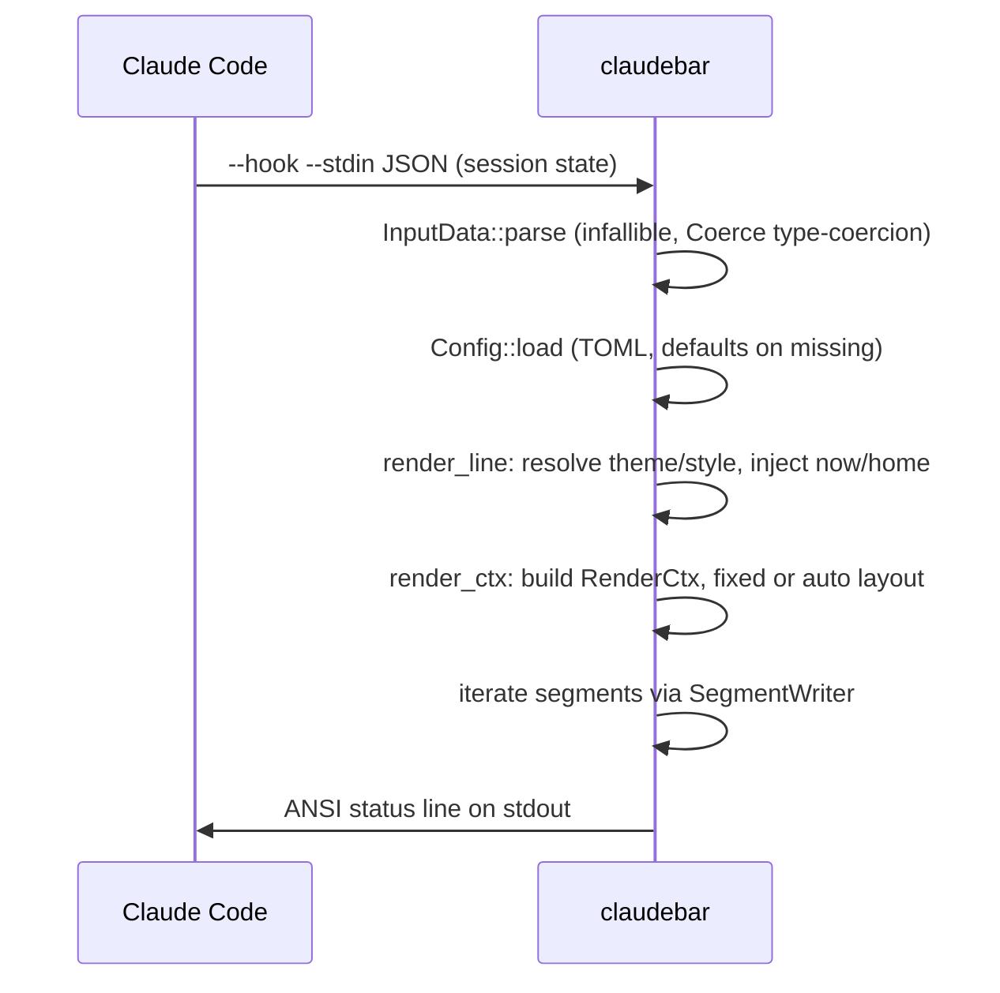

# Architecture overview

## Layout model

claudebar is a single binary with a layered module graph:

```text
main.rs / cli.rs          argument parse, stdin read, now() injection
        │
        ▼
model/                    InputData, Config, SegmentKind, Thresholds,
                          Theme, Style, Coerce<T>
        │
        ▼
render/                   render_line → render_with → RenderCtx
   │   ├─ writer.rs       SegmentWriter — the single place segments emit
   │   │                  colored, glyph-decorated text
   │   ├─ bar.rs          write_bar / write_bar_dots progress bars
   │   ├─ width.rs        visible_width (ANSI-stripping column count)
   │   └─ float.rs        best-effort plain-text side file (emit_float)
   ▼
segment/                  Segment trait; 12 implementations in SegmentKind::ALL
   │                      (dependency-injected context, no env reads)
   ▼
themes/ styles/           name → value registries (16 themes, 8 styles)
```

The TUI (`src/tui/`, feature-gated) depends on the same `model` and `render`
layers: the preview calls `render_with` with a fixture sample, so the live
preview can never diverge from the hook output.

## Render-composition sub-layers

`render/mod.rs` declares four composition helpers that segments build on:

- **`writer.rs`** — [`SegmentWriter`](repo://src/render/writer.rs) is the single
  place a segment emits colored, glyph-decorated text. A segment never embeds a
  raw ANSI code, never hardcodes a theme color, and never decides whether icons
  render; the active theme × style does the rest. Nested `colored_with` spans
  restore the innermost open color instead of leaving trailing text at the
  terminal default.
- **`bar.rs`** — `write_bar` appends a self-colored `width`-cell bar for `pct`
  percent, and `write_bar_dots` a quarter-resolution variant using a 5-level
  `levels` array; both clamp over-limit percentages and guarantee at least one
  filled cell when `pct > 0`.
- **`width.rs`** — `visible_width(s)` strips ANSI SGR escapes via a small state
  machine, then counts terminal columns: 1 per codepoint, 2 for wide CJK /
  kana / Hangul / emoji, 0 for combining marks. Pure Rust, no dependency
  tables; it drives the responsive auto-layout path.
- **`float.rs`** — `emit_float` writes a one-line ANSI-free summary of the
  selected segments to a file (e.g. for tmux / menu-bar piping). It is a
  best-effort side effect of the status render: any I/O error is silently
  swallowed so a float failure can never break the status line.

## Single-render-path invariant

`render_line(input, cfg, now)` is the **only** entrypoint for the hook output.
It resolves the configured theme/style/`$HOME`, reads any cached update
version, and delegates to `render_ctx`, which builds a `RenderCtx` and
dispatches to one of two compositors. The TUI preview
([`src/tui/preview.rs`](repo://src/tui/preview.rs)) calls `render_with` directly
with already-resolved theme/style and fixed `now` (`FIXED_NOW`) and home
(`PREVIEW_HOME`) — there is no second composition path. This invariant is
enforced by construction: segment implementations are pure functions over
`RenderCtx`.

`render_line` also triggers the float readout side effect when
`cfg.thresholds.float` is set; `render_with` (used by the TUI and tests) does
not — it only builds the status line.

## Segments

Each segment is a zero-sized struct implementing the `Segment` trait:

```rust
fn render(&self, ctx: &RenderCtx, out: &mut SegmentWriter) -> bool
```

- Returns `true` if it emitted anything, `false` to skip (e.g. no git repo,
  zero cost, no dev context).
- Segments never know about their neighbors; separators are inserted by the
  composition layer only between two non-empty segments.
- All ambient state (`now`, `home`, `tz_offset_seconds`, cached `update`
  version) is injected via `RenderCtx` — segments never call `std::env::var` or
  system time, and the update-notice cache read happens once in the render
  layer, never inside a segment.
- `SegmentKind::ALL` now enumerates **12** segments (Directory, Git, Model,
  Context, RateLimits, DevContext, Cost, Lines, Duration, Burn, Clock,
  UpdateNotice); `DEFAULT` is the 8-segment layout that mirrors the bash
  statusline.

## Layout: fixed vs auto

`render_ctx` selects the compositor from `cfg.thresholds.layout`:

- **fixed** — `render_fixed` writes every enabled segment in order onto a single
  line, inserting separators between non-empty segments and skipping empty ones
  (the default).
- **auto** — `render_auto` is the responsive layout: it renders each segment
  into its own `String`, drops empty ones, then greedily packs segments onto up
  to `max_lines` lines using `visible_width` so each line stays within the
  terminal width minus `wrap_margin`. Terminal width comes from `$COLUMNS`, then
  `stty size`, else 0 (unknown terminal), which disables wrapping and falls
  back to a single line.

## Feature gating

The `tui` feature (default-on) adds `ratatui`/`crossterm`/`ansi-to-tui` and the
whole `src/tui/` module (`lib.rs:48-49`). These crates are optional
dependencies and are never linked on the render hot path. `cargo build
--no-default-features` produces a **render-only hook** with no TUI dependency —
the render/float/hook path must stay TUI-free. `claudebar config` without the
feature exits 1 with a message pointing at the TOML config. This is declared in
`Cargo.toml` (`features`/optional deps) and enforced by CI and the Taskfile
`build-minimal` target.

## Data flow (render subcommand)

<!-- openwiki: mermaid below restored after rephrasing the Coerce<T> label that previously failed to parse. -->


A side effect: `render_line` calls `float::emit_float` when `thresholds.float`
is enabled (best-effort plain-text file; see
[Cross-session state](../systems/cross-session-state.md)).

## Key architectural constraints

- **Threading:** none — single-threaded render and TUI event loop. The only
  concurrency is the background update check, which spawns a detached child and
  never blocks the render.
- **Global state:** none — theme/style registries return owned values; `App` in
  the TUI holds all mutable configurator state.
- **Infallible render:** `InputData::parse` never fails; wrong-typed fields
  degrade to `None`; `render_with` never panics.
- **External I/O:** `src/segment/git.rs` is the only non-stdin external I/O in
  the render path (spawns `git`); the update-notice check spawns a detached
  child (`update --check`) at most once a day.
- **Deterministic tests:** `now`/`home`/`tz_offset` injection makes every
  render reproducible; golden snapshots (`tests/render_golden.rs`) pin exact
  output across the theme × style matrix.

## What to watch out for

- Do not add a second render path; extend `render_with` / `render_ctx` and the
  `Segment` trait.
- Keep the render/float/hook path free of `tui`-feature dependencies.
- When adding a segment: enum variant + label + `as_segment` wiring + module +
  writer conventions + unit tests + golden coverage (see
  `concepts/segment-seam.md`).
