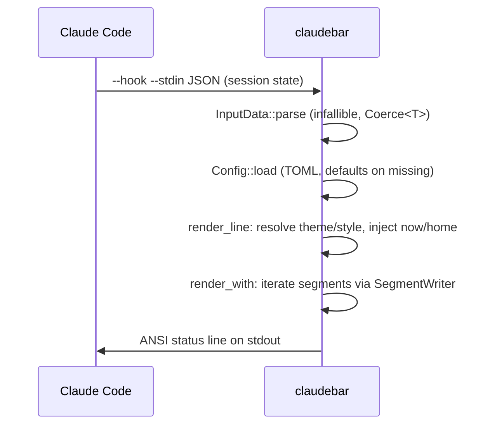

# Architecture overview

## Layout model

claudebar is a single binary with a layered module graph:

```text
main.rs / cli.rs          argument parse, stdin read, now() injection
        │
        ▼
model/                    InputData, Config, SegmentKind, Thresholds,
                          Theme, Style, Coerce<T>
        │
        ▼
render/                   render_line → render_with → RenderCtx
   │                      SegmentWriter emits ANSI; bar/width/float helpers
   ▼
segment/                  Segment trait; 11 implementations
   │                      (dependency-injected context, no env reads)
   ▼
themes/ styles/           name → value registries (16 themes, 7 styles)
```

The TUI (`src/tui/`, feature-gated) depends on the same `model` and `render`
layers: the preview calls `render_with` with a fixture sample, so the live
preview can never diverge from the hook output.

## Single-render-path invariant

`render_line(input, cfg, now)` is the **only** entrypoint for the hook output.
It resolves the configured theme/style/`$HOME`, builds a `RenderCtx`, and
delegates to `render_with`. The TUI preview calls `render_with` directly with
already-resolved values and a fixed `now` (`FIXED_NOW`) and home
(`PREVIEW_HOME`) — there is no second composition path. This invariant is
enforced by construction: segment implementations are pure functions over
`RenderCtx`.

## Segments

Each segment is a zero-sized struct implementing the `Segment` trait:

```rust
fn render(&self, ctx: &RenderCtx, out: &mut SegmentWriter) -> bool
```

- Returns `true` if it emitted anything, `false` to skip (e.g. no git repo,
  zero cost, no dev context).
- Segments never know about their neighbors; separators are inserted by the
  composition layer only between two non-empty segments.
- All ambient state (`now`, `home`) is injected via `RenderCtx` — segments
  never call `std::env::var` or system time.

## Feature gating

The `tui` feature (default-on) adds `ratatui`/`crossterm`/`ansi-to-tui` and the
whole `src/tui/` module (`lib.rs:47-48`). `cargo build --no-default-features`
produces a **render-only binary** with no TUI dependency — the render/float/hook
path must stay TUI-free. `claudebar config` without the feature exits 1 with a
message. CI (`rust.yml:55-66`) and Taskfile `build-minimal` enforce both
configurations.

## Data flow (render subcommand)



A side effect: `render_float` writes a tiny float file (see
[Cross-session state](../systems/cross-session-state.md)).

## Key architectural constraints

- **Threading:** none — single-threaded render and TUI event loop.
- **Global state:** none — registries return owned values; `App` in the TUI
  holds all mutable configurator state.
- **Infallible render:** `InputData::parse` never fails; wrong-typed fields
  degrade to `None`; `render_with` never panics.
- **Git subprocess:** `src/segment/git.rs` is the only non-stdin external I/O
  in the render path (spawns `git`).
- **Deterministic tests:** `now` and `home` injection makes every render
  reproducible; golden snapshots (`tests/render_golden.rs`) pin exact output.

## What to watch out for

- Do not add a second render path; extend `render_with` and segment trait.
- Keep the render/float/hook path free of `tui`-feature dependencies.
- When adding a segment: enum variant + label + module + writer conventions +
  unit tests + golden coverage (see `concepts/segment-seam.md`).