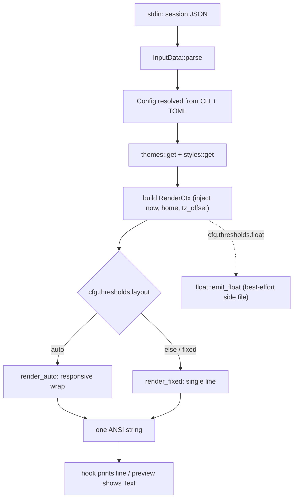

# Render pipeline: session JSON to ANSI status line

The composition layer turns `(input × config)` into one ANSI status line. Its
core invariant is that **`render_line` is the single entrypoint** shared by the
statusline hook and the TUI preview — code deliberately has no second rendering
path, so the live preview can never diverge from what the hook emits
(`src/render/mod.rs`, `src/lib.rs`, `src/tui/preview.rs`).

## The hot path at a glance



Caption: The end-to-end render hot path from session JSON stdin to the single
ANSI status line, shared by the hook and the TUI preview.

## Entrypoints

```rust
pub fn render_line(input: &InputData, cfg: &Config, now: i64) -> String
pub fn render_with(input, cfg, theme: &Theme, style: &Style,
                   now: i64, home: Option<&str>, tz_offset_seconds: i32) -> String
```

- **`render_line`** (`src/render/mod.rs`) is the hook/CLI-facing entrypoint. It
  resolves the theme and style through `themes::get(&cfg.theme)` and
  `styles::get(&cfg.style)`, reads `$HOME`, detects the local timezone offset,
  and delegates to `render_with`. It also triggers the optional float readout
  when `cfg.thresholds.float` is set.
- **`render_with`** is the lower-level seam the TUI preview and tests call with
  already-resolved theme/style and deterministic `now`/`home`, so those callers
  never re-derive ambient state. It builds the `RenderCtx` and dispatches to
  `render_auto` or `render_fixed` based on `cfg.thresholds.layout`.

`main.rs` drives `render_line` in three places: the primary `render` path
(reads stdin, parses `InputData`, resolves config, prints the line), the
`print_setup_preview` helper after `setup`, and `run_smoke`. The TUI preview
calls `render_with` directly, passing a fixed `FIXED_NOW` epoch and a fixed
`/home/me` home prefix so preview output is deterministic.

## Determinism and the no-I/O rule

The render hot path must **not** touch the network, the filesystem (except the
opt-in rate-limit sync cache described below), or the environment except
`$HOME` and timezone detection. That rule is enforced structurally:

- `now` (epoch seconds for reset countdowns), `home` (for `~` path
  abbreviation), and `tz_offset_seconds` are **injected** into `RenderCtx`;
  segments never read the system clock or `$HOME` themselves
  (`src/segment/mod.rs`). Tests and the preview therefore inject fixed values,
  and golden snapshots stay stable.
- `detect_tz_offset` reads the system local offset once, cached in a
  `LazyLock`, and falls back to `0` (UTC) when unavailable.

The timezone consumers are explicit and consistent: the **clock segment**
(`src/segment/clock.rs`) converts the injected `tz_offset_seconds` to a
`time::UtcOffset` via `UtcOffset::from_whole_seconds` and applies it to
`ctx.now` when formatting the wall-clock time; **`render_line`**
(`src/render/mod.rs`) injects the offset that `clock::detect_tz_offset()`
detected; and the **TUI preview / fixed-clock tests** inject `0` (UTC) so their
output is deterministic. The offset is never read from the ambient environment
inside `render_line`'s callers.

The one deliberate exception is **rate-limit sync** (`segment/limit_sync.rs`):
when `cfg.thresholds.limit_sync` is enabled, the RateLimits segment records each
render's `(reset, pct)` snapshot into an atomic per-window directory under the
cache dir and reads back the highest-seen value across sessions. This is the
only filesystem access on the render path, it is explicitly opt-in, and all its
I/O errors are swallowed so a cache failure can never break rendering
(`src/segment/rate_limits.rs`).

## Resolving theme and style

- `themes::get(name)` (`src/themes/mod.rs`) returns a fixed `Theme` struct of
  named `Color` slots by name; unknown names fall back to Tokyo Night.
- `styles::get(name)` (`src/styles/mod.rs`) returns a fixed `Style` (glyphs,
  icons flag, bar characters, separator) by name; unknown names fall back to
  Powerline.
- `Color(u8)` is an xterm-256 index rendered as SGR `\x1b[38;5;Nm`. On the hot
  path segments never allocate a throwaway color `String` — `Color::write_fg`
  appends the escape sequence directly into the output buffer, and `RESET`
  (`\x1b[0m`) ends every colored run (`src/model/palette.rs`).

## Composition: fixed vs auto layout

`render_with` selects the layout from `cfg.thresholds.layout`:

- **`render_fixed`** (any layout other than `"auto"`, the default) iterates
  `cfg.segments` in order, renders each through its own `SegmentWriter`, and
  joins adjacent non-empty segments with `separator` — producing exactly one
  line.
- **`render_auto`** (`layout: "auto"`) renders every segment to its own owned
  string, then greedily packs segments across up to `max_lines` lines so each
  line fits within the terminal width minus `wrap_margin`. A width of 0
  (unknown terminal) disables wrapping and falls back to the fixed single-line
  behavior. `terminal_width()` reads `$COLUMNS` first, then `stty size`, else
  returns 0.

The composer (not any segment) owns separators. `separator` appends a space,
the style's separator glyph painted in the theme's separator color, then a
space; the lean style's empty separator emits just a single space with no color
codes. `separator_width` mirrors that (two spaces plus the glyph's visible
width, or 1 for lean) so the auto path can account for separator cost when
measuring fit.

An empty/absent segment returns `false` from its `render`, is skipped entirely,
and takes its adjoining separator with it — so no dangling separator ever
appears between a missing segment and its neighbor.

## `SegmentWriter`: the single emission point

`SegmentWriter` (`src/render/writer.rs`) is the one place segments emit
colored, glyph-decorated text. Centralizing emission here means a segment never
embeds a raw ANSI code, never hardcodes a theme color, and never decides
whether icons render — the active theme × style does the rest.

- Methods `colored`, `colored_with`, `colored_fmt`, `dim`, `icon`, `bar`,
  `bar_pct`, `window_gap`, `raw`, `raw_fmt` buffer into a single internal
  `String`.
- `colored`/`colored_with`/`colored_fmt`/`raw_fmt` are the
  **allocation-avoidance** hot path: they write directly into the buffer via
  `write_fg` and `std::fmt::Arguments`/`format_args!` instead of allocating a
  throwaway `String` per emission.
- `colored_with` maintains an **active-color stack**: an inner span ending with
  a reset restores the enclosing span's color rather than leaving trailing text
  at the terminal default.
- `bar` delegates to `write_bar` in `src/render/bar.rs`, which builds the
  filled/empty progress bar into the buffer directly, mirroring the bash
  `make_bar` (no allocation beyond the result, fills clamped to width, at least
  one filled cell whenever `pct > 0`).
- `icon` is a no-op when the active style disables icons, so minimal/ASCII
  styles drop glyphs without per-segment branching.

Segments buffer their output and know neither their neighbors nor whether a
separator precedes or follows them — the composer decides separators during
composition (`src/segment/mod.rs`).

## The `Segment` seam and `RenderCtx`

Each configured segment is a zero-sized struct implementing `Segment`, resolved
from its `SegmentKind` via `as_segment()`. Every segment receives a `RenderCtx`
carrying `input`, resolved `theme`/`style`, `thresholds`, and the injected
`now`/`home`/`tz_offset_seconds` — never ambient state (`src/segment/mod.rs`).

Host-provided strings (cwd, git branch, model display name) are sanitized with
`sanitize::strip_control` before being written, stripping ESC/BEL/CR/LF so
host data cannot inject ANSI or OSC escape sequences into the line.

## Float readout (optional side effect)

When `cfg.thresholds.float` is set, `render_line` also emits a best-effort
plain-text readout file (`src/render/float.rs`): the segments named in
`float_segments` are rendered through the **same** `Segment` implementations
with the ASCII style (icons off) and then stripped of ANSI, joined by
`float_sep`, and written atomically to `float_file` (`~` expanded via `home`).
This reuses the real render path — no second code path — and any I/O error is
silently swallowed so a float failure never breaks the status render. Its
`strip_ansi` helper is a CSI state machine that removes escape sequences.
This is the seam for piping the status line to tmux, a terminal status bar, or a
menu-bar app.

## Visible-width measurement

`width::visible_width` (`src/render/width.rs`) computes the visible terminal
width of an ANSI string in columns: it strips SGR escapes, counts each
codepoint as 1 column, wide CJK/kana/Hangul/emoji as 2, and combining marks as
0. It is pure Rust with no external tables and is used by the auto-layout path
to measure segments and separator widths before deciding where to wrap.

## Invariants

- **One rendering code path.** `render_line` (hook/CLI) and `render_with`
  (preview/tests) share the same composition; there is no second path.
- **No director I/O in segments.** Rendering is deterministic because `now`,
  `home`, and `tz_offset_seconds` are injected; the only filesystem touch is
  the opt-in rate-limit sync cache.
- **Composer owns separators.** Segments never emit separators and never know
  their neighbors; empty segments are dropped with their separators.
- **No raw host escapes.** Host strings pass through `strip_control` before
  emission.

## Focused tests that matter here

- `src/render/mod.rs` unit tests cover `separator_width` (powerline 3, lean 1,
  plain 3), `terminal_width` from `$COLUMNS` (serialized through a global
  `ENV_MOCK` mutex because they mutate the process environment), auto-layout
  wrapping under a constrained column count, and that `render_with` does not
  panic with no `$HOME`.
- `src/render/writer.rs` verifies the active-color stack restoration through
  nested `colored_with` spans.
- `src/render/bar.rs` pins progress-bar cell counts (zero, one-cell minimum,
  half, full, over-limit clamp, zero width).
- `src/render/width.rs` covers ASCII/CJK/kana/emoji/combining/SGR-stripping
  widths deterministically.
- `src/render/float.rs` covers `strip_ansi`, kebab segment-name parsing via
  serde, `~` path expansion, and that the float output is ANSI-free and
  respects segment selection.
- `tests/render_golden.rs` renders every fixture under the default config with
  a fixed clock and `$HOME` to pin exact ANSI output (instant golden
  snapshots), asserting no stray ESC leaks from host strings.
- `src/segment/rate_limits.rs` verifies the sync cache shows the highest-seen
  percentage across sessions when `limit_sync` is enabled.
