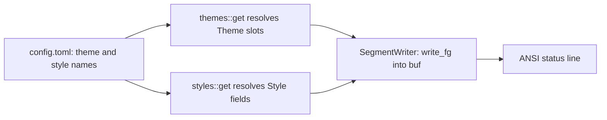

# Themes, styles, and the color model

Claudebar separates **look-and-feel** into two orthogonal axes:

- **Themes** (`src/themes/mod.rs`) are a fixed struct of *named color slots* —
  one 256-color ANSI index per semantic role (`dir`, `git_branch`, `bar_ok`,
  `separator`, `dim`, …).
- **Styles** (`src/styles/mod.rs`) are pure data describing *how* segments are
  separated and decorated: the separator glyph, bar characters, the icon
  toggle, and a `GlyphSet` of per-segment glyphs.

A theme and a style are independently selectable in `config.toml` and combine at
render time: a segment picks *what* to show, a style picks *how* to glyph it,
and a theme picks *what color* it gets. The color and style definitions live in
`src/model/palette.rs` and `src/model/style.rs`; the built-in registries live in
`src/themes/mod.rs` and `src/styles/mod.rs`.

## The color model: `Color` and SGR emission

`src/model/palette.rs` defines a single `Color` type:

```rust
pub struct Color(pub u8);
```

It is a **256-color ANSI palette index** (0–255), rendered as the SGR
foreground sequence `\x1b[38;5;<n>m`. It implements `Copy`, `Eq`, and `Debug`,
so a theme can be a `Copy` value held by reference through a render pass.

Emission happens two ways, and the difference matters on the render hot path:

- `Color::fg(self) -> String` formats and **allocates** a fresh `String` —
  useful for tests and simple call sites.
- `Color::write_fg(self, buf: &mut String)` **pushes straight into a caller's
  `String` buffer**, avoiding the throwaway allocation. All render code paths
  (`SegmentWriter`, the composer's `separator()`, and `bar::write_bar`) use
  `write_fg`, because a status line is built with many colored runs per frame.

`palette.rs` also exports `RESET: &str = "\x1b[0m"` — the SGR reset that ends
every colored run.

## The `Theme`: a fixed struct of named color slots

A theme is deliberately **not a map** — it is a fixed struct with one `Color`
field per semantic role (`src/model/palette.rs`):

```rust
pub struct Theme {
    pub dir: Color,
    pub git_branch: Color,
    pub ahead: Color,
    pub behind: Color,
    pub modified: Color,
    pub untracked: Color,
    pub token: Color,
    pub bar_ok: Color,
    pub bar_warn: Color,
    pub bar_crit: Color,
    pub bar_track: Color,
    pub separator: Color,
    pub dim: Color,
    pub reset: Color,
    pub model: Color,
    pub project: Color,
    pub stash: Color,
    pub lines: Color,
    pub cost: Color,
    pub duration: Color,
    pub clock: Color,
    pub effort: Color,
    pub burn: Color,
}
```

**Adding a slot is a compile error in every theme that omits it**, so a theme can
never silently miss a color the renderer expects. The compiler is the safety
net that guarantees every built-in theme fills every slot. The doc comments on
each field document its semantic role (e.g. `dir` = directory path, `project`
= repo-root name, `bar_warn` = progress fill at/above warn).

Some newer slots document a **fallback convention** in commentary rather than
code: `project` "falls back to `dir`" and `stash` "falls back to `git_branch`"
in themes that predate those slots — i.e. they are intentionally set to the
same index as the fallback slot in older palettes.

Themes are resolved by name via `themes::get(name)` (`src/themes/mod.rs`).
Unknown names **fall back to Tokyo Night**:

```rust
pub fn get(name: &str) -> Theme {
    match name {
        "ayu-mirage" => AYU_MIRAGE,
        // ... one arm per built-in theme ...
        _ => TOKYO_NIGHT,
    }
}
```

The default theme is `tokyo-night` — set in `Config::default()` and again in
the registry's fallback arm.

## The built-in theme registry

All built-in themes live in **`src/themes/mod.rs` as `pub const` values**,
with **no per-theme modules** and no merge-conflict surface. The `NAMES` slice
is the public, display-order list, and the default is Tokyo Night:

```rust
pub const NAMES: &[&str] = &[
    "tokyo-night", "ayu-mirage", "catppuccin", "cobalt2",
    "everforest-dark", "github-dark", "gruvbox", "kanagawa-wave",
    "moonfly", "night-owl", "nord", "one-dark", "dracula",
    "rose-pine", "sonokai", "solarized-dark",
];
```

There are **16 built-in themes**. Each is a `Theme` literal of `Color(n)`
indices (e.g. `TOKYO_NIGHT.dir = Color(39)`). The registry also holds two
focused unit tests: `all_known_names_resolve` (every `NAMES` entry resolves
through `get`) and an unknown-name fallback test. A third test,
`bar_thresholds_distinct`, enforces a real invariant: for every theme the
three bar fill colors `bar_ok`, `bar_warn`, and `bar_crit` must be pairwise
distinct (so the warn/crit bands are always visually distinguishable).

## Style: separators, glyphs, icons, and bar chars

`src/model/style.rs` defines a style as **pure data** — segments never branch
on the style; they read its fields. The two main types:

```rust
pub struct GlyphSet {
    pub branch: &'static str,
    pub ahead: &'static str,
    // ... one per segment/feature ...
}
pub struct Style {
    pub separator: &'static str,
    pub window_gap: &'static str,
    pub icons: bool,
    pub glyphs: GlyphSet,
    pub bar_fill: char,
    pub bar_empty: char,
}
```

`Style`'s fields are:

- `separator` — the glyph placed **between adjacent non-empty segments** by the
  composer, painted in the theme's `separator` color with a space on each side.
  The "lean" style uses an **empty** separator, so the composer emits just a
  single space with no color codes.
- `window_gap` — a **lighter, intra-segment** separator joining two related
  "windows" inside one segment (e.g. rate-limits' 5h/weekly gauges), painted in
  the theme's `dim` color so the pair reads as one grouped unit rather than a
  segment boundary.
- `icons` — when `false`, icons are suppressed entirely (minimal / plain /
  ASCII styles).
- `glyphs` — the `GlyphSet` this style draws from.
- `bar_fill` / `bar_empty` — the filled and empty cells of a progress bar track.
  These are single `char`s so `bar::write_bar` can push them directly.

`GlyphSet` stores glyphs as `&'static str` (not `char`) because rich styles use
Nerd Font PUA / multi-byte glyphs (e.g. `\u{f0c29}` for the token icon), while
ASCII fallbacks use ASCII (`#`, `^`, `~`, …).

A style is pure data: the ASCII fallback, for instance, is just a `GlyphSet` of
ASCII characters with `icons = false` and `#`/`-` bar chars.

## The built-in style registry

All built-in styles live in **`src/styles/mod.rs` as `pub const` values**, again
with no per-style modules. The `NAMES` slice is the display-order list; Powerline
is the default:

```rust
pub const NAMES: &[&str] = &[
    "powerline", "lean", "plain", "rounded", "minimal", "unicode", "ascii",
];
```

There are **7 built-in styles**:

- **powerline** (default) — Nerd-Font powerline separator `\u{e0b1}`, icons on,
  heavy-solid bar chars.
- **lean** — same powerline glyphs but an **empty** separator (a single space
  between segments).
- **plain** — ASCII pipe `|` separator, icons off, `#`/`-` bar chars, ASCII
  glyphs.
- **rounded** — the rounded powerline separator `\u{e0b5}`, otherwise reuses
  `POWERLINE.glyphs`.
- **minimal** — a middot separator, icons off, but reuses `POWERLINE.glyphs`
  (icons are gated by the `icons` flag, not the glyph table).
- **unicode** — a plain-text `❯` separator with full-width unicode glyphs
  (`█`/`░` bars, `⎇`/`◉`/`⬡` icons).
- **ascii** — icons-off, ASCII-only glyphs and `#`/`-` bars; the base for the
  float readout.

Styles are resolved via `styles::get(name)`; unknown names **fall back to
Powerline**. The module's tests assert every `NAMES` entry resolves and that an
unknown name falls back to `POWERLINE`.

Several styles **reuse `POWERLINE.glyphs`** (lean, rounded, minimal). This is
why `icons` is a separate flag: `minimal` draws powerline glyphs but suppresses
them via `icons = false`, proving segments read the `icons` flag through the
writer rather than branching on a hardcoded style identity.

## How theme × style reach a segment

A theme and style are resolved once at the render boundary
(`render::render_line` / `render_with`), then threaded through a `RenderCtx`
into every segment and into the composer (`src/render/mod.rs`):

```rust
let theme = themes::get(&cfg.theme);
let style = styles::get(&cfg.style);
```

Inside `RenderCtx` (`src/segment/mod.rs`) the segment sees
`theme: &'a Theme` and `style: &'a Style`. Segments never embed a raw color and
never decide whether icons render — they emit through `SegmentWriter`
(`src/render/writer.rs`), which centralizes emission:

```rust
pub fn colored(&mut self, color: Color, text: &str) { color.write_fg(&mut self.buf); ... }
pub fn icon(&mut self, glyph: &str) {
    if self.style.icons && !glyph.is_empty() { self.theme.dim.write_fg(&mut self.buf); ... }
}
pub fn dim(&mut self, text: &str) { self.colored(self.theme.dim, text); }
```

`SegmentWriter::icon` applies the `icons` gate centrally, so minimal/ASCII
styles drop every glyph with **no per-segment branching**. `window_gap()` and
`bar()`/`bar_pct()` likewise read `theme.dim`, `theme.separator`, `theme.bar_track`,
`theme.bar_*`, `style.window_gap`, and `style.bar_fill`/`bar_empty` in one place.



*Config-selected `theme` and `style` names resolve through the registries once, then feed a single `SegmentWriter` that emits every colored run.*

The composer's inter-segment `separator()` and the writer's intra-segment
`window_gap()` implement the two distinct join styles from the shared `Style`
struct: the separator is painted in `theme.separator` (a segment boundary),
while `window_gap` is painted in `theme.dim` (related windows grouped as one).
`separator_width()` mirrors `separator()` for layout math (2 + the glyph's
visible width, or 1 for the empty lean separator).

### The float readout is deliberately style-independent

`render/float.rs` renders each `float_segments` entry with the **ASCII style**
(icons-off, ASCII-only glyphs) and **strips ANSI** afterwards, so the float
file's plain text is independent of the user's configured theme/style. It still
uses theme colors internally but they are immediately stripped away.

## Configuration and failure semantics

The theme and style are plain `String` fields on `Config` (`src/model/config.rs`)
whose defaults are `"tokyo-night"` and `"powerline"`:

```rust
Self {
    theme: "tokyo-night".into(),
    style: "powerline".into(),
    // ...
}
```

- **Config-less operation** is first-class: a missing config file yields
  `Config::default()` (Tokyo Night + Powerline).
- **Unknown CLI names** are warned about and fall back to the defaults
  (`src/main.rs`): an unknown `--theme` prints `unknown theme '<t>' — using
  tokyo-night`, an unknown `--style` similarly falls back to powerline, and the
  same `themes::get` / `styles::get` fallback arms make rendering robust even if
  an unknown name reaches them from TOML.
- The TUI config editor offers the registry `NAMES` lists for pickers, indexes
  theme swatches by `themes::NAMES` position (`src/tui/app.rs`), and keeps a
  swatch cache in `themes::NAMES` order.

## Adding a theme or style

[`CONTRIBUTING-themes.md`](repo://CONTRIBUTING-themes.md) at the repo root is the
**canonical theme-contribution path**. It walks a contributor through cloning a
`src/themes/<name>.rs` template (e.g. `src/themes/catppuccin.rs`), picking a
`Color(n)` xterm-256 index (0–255) nearest to each intended hex color, and making
the **three one-line registrations** in `src/themes/mod.rs`:

1. `pub mod my_theme;` — declare the module;
2. add `"my-theme"` to the `NAMES` slice;
3. add a `"my-theme" => my_theme::theme()` arm to `get`'s match.

It then has you preview the theme across all styles (`claudebar render --theme
my-theme --style <s>`) and confirm `cargo test`, `clippy -D warnings`, and
`fmt --check` before opening a PR. The registry currently ships all 16 built-in
themes as inline `pub const` values in `src/themes/mod.rs`, but the contributed
`src/themes/<name>.rs` module pattern is the supported way to add a new one.

- **Theme:** follow `CONTRIBUTING-themes.md` — create a `src/themes/<name>.rs`
  `theme()` function returning a full `Theme` struct literal, then make the three
  one-line registrations in `src/themes/mod.rs`. Because `Theme` is a fixed
  struct and `get` returns a `Theme`, **every theme must fill every slot** — the
  compiler enforces completeness, so a new theme can never silently miss a color.
  Follow the fallback convention for the `project`/`stash` slots if you want
  older-palette behavior.
- **Style:** add a `Style` and, if needed, a `GlyphSet` to `src/styles/mod.rs`,
  register the name in `styles::NAMES`, and add a `get` match arm. Reuse
  `POWERLINE.glyphs` with `icons: false` for a minimal/plain variant rather
  than duplicating the glyph table.

The registry layout (one file, `pub const` values, no merge-conflict surface) and
the exhaustive `get` match arms plus the focused `all_known_names_resolve`,
fallback, and `bar_thresholds_distinct` tests keep the registries honest when they
change.
