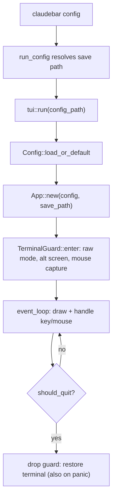

# TUI configurator (feature-gated)

The TUI configurator is an optional interactive editor for `config.toml`,
launched by the `config` subcommand (`claudebar config`). It is built only when
the `tui` Cargo feature is enabled. Its defining property is that the live
preview renders through the **exact same** `render_with` hot path the statusline
hook uses, so what you see in the preview can never differ from what the hook
emits; saving writes the edited `Config` back to the config path as TOML.

## Feature gating and the "never on the hot path" rule

The TUI is isolated from the render hot path at the Cargo level. In
`Cargo.toml` the `tui` feature pulls in the three optional dependencies —
`ratatui`, `crossterm`, and `ansi-to-tui` — and is enabled by default:

```
[features]
default = ["tui"]
tui = ["dep:ratatui", "dep:crossterm", "dep:ansi-to-tui"]
```

These are optional dependencies, so they are only linked when the feature is
selected; `render_line`, `render_with`, and the rest of the render path never
depend on them. Because `tui` is in `default`, a plain `cargo build` includes
the configurator, but building **without it** —
`cargo build --release --no-default-features` — yields a minimal render-only
hook with ratatui/crossterm/ansi-to-tui absent from the binary. In `src/lib.rs`
the whole `pub mod tui;` is gated behind `#[cfg(feature = "tui")]`. Running the
binary without the feature makes `run_config` print a message that the
configurator is unavailable and points the user at editing the TOML directly,
returning a failure exit code.

## Entrypoint and lifecycle

`run_config` in `src/main.rs` is invoked from the `config` subcommand. It
resolves a save path from the `--config` override, falling back to
`Config::default_path()`, and calls `claudebar::tui::run(path)`.
`tui::run` is the single entrypoint into the configurator:

```rust
pub fn run(config_path: Option<PathBuf>) -> Result<(), String>
```

`run` loads the config with `Config::load_or_default(config_path.as_deref())`
(a missing or malformed file yields the default config, so a broken config can
never block the editor from opening), computes the effective save path from the
explicit path or `Config::default_path()`, constructs the `App` state, enters
the terminal, runs the event loop, and always drops the `TerminalGuard` before
returning.



Caption: The life of a `claudebar config` session, from CLI dispatch through the
event loop to terminal teardown.

## TerminalGuard: RAII terminal restore

`TerminalGuard` owns a `Terminal<CrosstermBackend<Stdout>>`. Its `enter`
constructor enables raw mode, enters the alternate screen, enables mouse
capture, and builds the ratatui terminal. Its `Drop` implementation — which runs
unconditionally when the guard is dropped, including on panic or any early
return from the event loop — disables raw mode, disables mouse capture, leaves
the alternate screen, and restores the cursor. This is the page's key safety
invariant: no matter how the session ends, the user's terminal is always
restored.

## Split-pane UI and preview

`ui::draw` renders a two-row layout: a top row with a left **menu panel** and a
right **detail panel**, and below it a **preview** strip, a one-line status row,
and a hint bar. `draw` refuses to render if the terminal is smaller than 80
columns by 20 rows, showing a "Terminal too small (min 80×20)" message instead.
The panel `Rect`s are stored on the `App` (via `Cell` interior mutability) each
frame so the mouse handler can hit-test clicks against the left and right
panels.

### Live preview via the real render path

The **preview** is the most important pane. `preview::render` resolves the
current theme and style from the edited config, then calls `render_with` on the
currently selected sample with a **fixed** `now` (`FIXED_NOW`, an epoch-seconds
constant of `1_899_990_000`) and a fixed home prefix (`PREVIEW_HOME =
"/home/me"`) so reset countdowns and directory abbreviation are deterministic;
it also injects a zero timezone offset so the TUI preview is always UTC. It then
converts the resulting ANSI string into a ratatui `Text` via
`ansi_to_tui::IntoText`. Because it funnels through `render_with` — the same
function behind `render_line` — there is structurally no second render path for
the preview to drift on. (`render_with` internally performs its own cache read
for the update badge via `cached_update`, unlike `render_line`, whose update
knowledge is threaded in from `render_line` itself.)

### Preview samples

`sample::all()` returns six named `Sample`s, each an `InputData` parsed once at
startup from a committed fixture so the preview is byte-identical to what the
hook would emit for that input: `typical`, `over-limit 5h`, `no git`, `no
effort`, `dev context`, and `weekly window`. `p` cycles forward and `P`
backward through these samples.

## Configurator state and mutation logic

`app.rs` deliberately keeps all state and its mutating logic **free of ratatui
draw calls** so the helpers can be unit-tested without a terminal. The `App`
holds the live `config`, a `saved_config` snapshot taken at `new`/`save`/`reset`
used by `is_dirty()`, cursor state (`flat_cursor`, `menu_cursor`,
`detail_cursor`, `scroll_offset`), the rebuilt flat `list_rows` /
`selectable_indices` / `section_starts`, the focused panel, a `swatch_cache`
built from `themes::NAMES`, the preview samples, transient `status`, and the
mode flags (`pending_reset`, `pending_quit`, `reorder_mode`, `show_help`,
`should_quit`).

The list is built by `build_list`, which orders rows in four sections —
Segments, Theme, Style, Thresholds — placing **enabled segments first in config
order, then disabled segments in canonical `ALL` order** with a divider between
them, and records `section_starts` (the flat-cursor index of each section's
first selectable row). Rebuilding happens on `toggle_cursor`, `reset`, and
moves.

Key mutations:

- **`toggle_cursor`** toggles a segment between enabled/disabled via
  `toggle_segment`, then rebuilds the list and follows both cursors to the
  segment's new position.
- **`move_segment`** swaps a segment with its up/down neighbor in `Dir`
  direction (boundary and out-of-range moves are no-ops); reorder mode drives
  this with `j`/`k`, entering via `m` on an enabled segment and leaving via
  `m`/`Enter`/`Esc`.
- **`nudge_threshold`** moves numeric fields by a delta with mutual clamping
  (warn < crit ≤ 99, bar_width clamped to 2–20); **`cycle_threshold_enum`**
  cycles string-typed fields (`clock_mode`: auto→12h→24h→off; `layout`:
  fixed→auto). In the Thresholds section of the right panel, `-`/`=` nudge by
  ±1 and `_`/`+` by ±5; Space/Enter cycle the enum-typed fields.
- **`apply_move_is_select`** applies the selected theme/style row to
  `config.theme` / `config.style` as soon as the cursor lands on it (move-is-
  select semantics).

### The threshold editing surface

Thresholds live in the right panel's fourth section and are driven by the
`ThresholdField` enum, whose six variants are exactly
`Warn`, `Crit`, `WeeklyShowAt`, `BarWidth`, `ClockMode`, and `Layout`
(`detail_len` returns `6` for the Thresholds section to match). Each variant
has inline help text produced by `threshold_help`, shown in the status line:
`warn`/`crit` (bar color transitions at those context-usage percents),
`weekly_show_at` (the seven-day window appears once usage reaches this percent),
`bar_width` (progress-bar width in cells), `clock_mode` (12h/24h/off), and
`layout` (fixed single line vs. auto responsive wrap). Numeric fields are
nudged; enum-typed fields are cycled. (`max_lines` and `wrap_margin` remain
TOML-only auto-layout fields; they are not part of the TUI threshold surface.)

A test invariant — `every_segment_kind_has_help_text` — ties segment help text
to the `SegmentKind` enum: it iterates every variant in `SegmentKind::ALL`
(12 segments, not just the 8 in `DEFAULT`) and asserts that `segment_help`
returns a non-empty string containing that segment's `label()`. The purpose is
to guarantee that a newly added `SegmentKind` variant ships with a help line
rather than an empty description in the configurator.

## Save, dirty tracking, and safe-quit/reset guards

`is_dirty()` compares the live config against `saved_config`. `save()` persists
via `Config::save(path)` — which serializes to pretty TOML, creating parent
directories — then replaces `saved_config` and reports the outcome in `status`
(Success on write, Error on I/O or parse failure, Warning when there is no save
path). A save path is always present under `tui::run` (it falls back to
`Config::default_path`), but `App::save` still handles the `None` case.

`q`/`Esc` does not quit immediately if the config is dirty: it arms
`pending_quit`, and the status line prompts `[s] save & quit`, `[q] discard`,
or any other key to cancel. `r` arms `pending_reset` with a confirm/cancel
prompt. These two-step guards are handled in `handle_pending_quit` /
`handle_pending_reset`, which run at high priority in `handle_key` before normal
dispatch. Navigation keys are silent no-ops while a guard banner is showing so
the prompt cannot be dismissed by accident.

## Event loop and input dispatch

`event_loop` draws every iteration, then polls events with a 200 ms timeout so
the frame refreshes even with no input. Key events are dispatched only on
`KeyEventKind::Press`; mouse events are `ScrollUp`/`ScrollDown` (navigate within
the focused panel) and left clicks (select panel and item via hit-testing the
stored panel `Rect`s). Keyboard handling is strictly prioritized in
`handle_key`: help overlay consumes all input, then pending-reset, then
pending-quit, then reorder mode, then normal dispatch.

## Relationship to the render pipeline

The TUI is a *consumer* of the same composition layer as the hook. `render_line`
(resolve theme/style, read `$HOME`, detect TZ, call `render_with`) is the hook's
face; `render_with` is the lower-level seam that accepts already-resolved
theme/style and injected `now`/`home`/`tz_offset`. The preview calls
`render_with` directly with deterministic values, so it shares the fixed-vs-auto
layout dispatch and every segment-rendering rule. See
[/openwiki/architecture/render-pipeline](/openwiki/architecture/render-pipeline.md)
for the shared path and
[/openwiki/concepts/themes-and-styles](/openwiki/concepts/themes-and-styles.md)
for the theme/style resolution the preview relies on.

## Focused tests

Because `app.rs` and the pure helpers are draw-free, they are directly
unit-tested: `toggle` enable/disable/involutive, `move` up/down/boundary/no-op,
`build_list` ordering (enabled before disabled), `reset` restoring defaults and
clearing dirty, `save` clearing dirty, cursor-following on toggle and reorder,
theme move-is-select updating config and dirty, sample cycling wrapping back to
the first sample, and `every_segment_kind_has_help_text` tying segment help to
`SegmentKind`. `ui.rs` tests that a style row shows its duration glyph only
when the style enables icons, mirroring the render-time gating.
