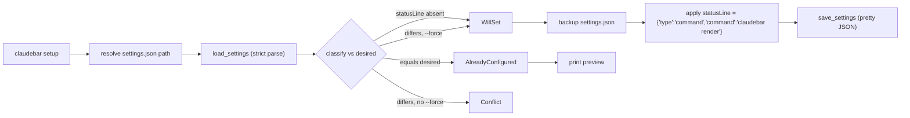

# Claude Code hook: setup and statusLine wiring

Claude Code drives a per-session status line by invoking the command stored in
the `statusLine` key of its `settings.json` (`~/.claude/settings.json`).
claudebar integrates with Claude Code by patching that single key to point at
`claudebar render`, and by shipping a legacy Bash statusline whose segment
order the Rust default layout mirrors. The whole integration lives in
`src/setup.rs` (the patch logic) with dispatch and CLI plumbing in `src/cli.rs`
and `src/main.rs`.

## The wiring model

`setup` treats Claude Code's `settings.json` as a **foreign, user-owned file** —
not claudebar's own TOML config. It mutates exactly one key (`statusLine`),
never touches any other key, and validates the file strictly before writing
(`src/setup.rs` module docs, `apply`).

Caption: `claudebar setup` resolves the path, strictly parses, classifies the
current `statusLine` against the desired value, then backs up, applies, and
saves only when safe or forced.

## Entrypoints and control flow

- **`claudebar setup`** (`Command::Setup` in `src/cli.rs`) is the entrypoint
  that wires the hook. `main.rs` dispatches it to `run_setup`, which resolves
  the settings path from `--settings-path`, then `$SETTINGS`, then
  `$HOME/.claude/settings.json` (`default_settings_path`).
- The desired value is a **fixed constant**: `STATUSLINE_COMMAND = "claudebar
  render"`, wrapped as `{"type":"command","command":"claudebar render"}` by
  `desired_status_line`. It is never built by formatting external user input
  into the JSON command field. An optional `--binary-path PATH` substitutes an
  absolute install location in place of assuming `claudebar` is on `$PATH`
  (used by `install.sh`).
- After a successful write, `run_setup` calls `print_setup_preview`, which
  renders a built-in fixture through the real CLI config path so `setup` proves
  the wiring works without needing to restart Claude Code and hope.

## Classification and failure semantics

`classify(settings, desired, force)` maps the current state to an `Outcome`:

- **Missing key** → `WillSet { previous: None }` (nothing to clobber).
- **Equal to desired** → `AlreadyConfigured` — no write, prints the preview.
- **Different, no `--force`** → `Conflict { existing }` — refuses to overwrite
  and exits failure, telling the user to rerun with `--force`.
- **Different, `--force`** → `WillSet { previous: Some(existing) }`.

Both `WillSet` and `Conflict` print a `statusLine:` diff block showing `- old`
and `+ new`. `WillSet` then prompts `Apply this change? [y/N]` unless `--yes`
was given; in a non-interactive session without `--yes` it refuses (exits
failure) rather than guessing. `--print` shows what would change and exits
without writing.

## The strict-parse exception

Unlike `crate::model::Config` and `InputData::parse`, `setup.rs` explicitly
does **not** follow the forgiving/infallible-parse philosophy. Malformed
`settings.json` must surface as a typed `SetupError` (`Io` or `Parse`), per
CLAUDE.md's error-handling conventions, rather than silently degrading to a
default. `load_settings` treats a missing file as an empty JSON object (there
is nothing to merge into yet) but treats invalid JSON or a non-object root as a
hard error. On a parse failure of an existing file, `run_setup` first backs up
the file to `settings.json.bak-{now}` so the user's original is never lost.

## Safety: backup before overwrite

Before writing, `run_setup` backs up the existing `settings.json` via
`backup_settings`/`backup_path`, producing `settings.json.bak-{now}`. The
backup only happens when the file already exists. `save_settings` pretty-prints
the JSON with a trailing newline and creates parent directories as needed,
mirroring `Config::save`.

## Diagnostics and operations hooks

- `check_nerd_font()` detects installed Nerd Fonts via `fc-list :family`
  (fastest, most accurate) or falls back to scanning common font directories
  for `.ttf`/`.otf` files with "Nerd" in the name — used both by `doctor` and
  by config bootstrap fallback.
- `resolve_editor_from(EDITOR, VISUAL)` picks the editor for `claudebar edit`
  (EDITOR wins over VISUAL; falls back to `vi`).
- `claudebar doctor` checks five things including whether `statusLine` is
  configured: it loads settings, reads the `statusLine.command` string, and
  reports success if it contains `claudebar` (always exits 0 as informational).

## Relation to other commands

`setup` is one of the integration subcommands. `sync` adds newly introduced
segments to an existing config in canonical positions; `doctor` reports
diagnostics; `edit` opens the config in `$EDITOR`, initializing it if missing.
Render overrides (`--theme`, `--style`, `--config`, `--segments`) are attached
to `setup` via `Overrides` and win field-by-field over top-level overrides in
`Cli::effective_overrides`.

## The legacy bash statusline and default-layout parity

`statusline-command.sh` is the legacy Bash statusline implementation: it reads
session JSON from stdin, requires `jq` and `git`, and renders segments
`directory | git | tokens+ctx-bar | rate-bar+timer | dev-context | model` with
the Tokyo Night palette and Powerline separators. It receives stdin regardless
of the render-path `Overrides` plumbing.

The Rust `Config::default` layout mirrors that Bash segment order deliberately:
its `SegmentKind::DEFAULT` order (`directory`, `git`, `model`, `context`,
`lines`, `rate-limits`, `cost`, `duration`) places `lines` between `context`
and `rate-limits`, matching the Bash statusline's ordering rather than the
canonical `SegmentKind::ALL` order. This parity is guarded by the
`default_matches_bash_layout` test, which asserts the default theme, style,
segment order, and warn/crit thresholds.

## Focused tests

`src/setup.rs` unit tests cover: `desired_status_line` with and without a
binary-path override; `classify` across all four combinations of force and
state; malformed JSON and non-object roots surfacing as `Parse` errors; a
missing file loading as an empty object; save-then-load roundtrips;
`apply` preserving unrelated keys; backup path construction and copy behavior;
config-path resolution precedence; and editor resolution precedence. The
`default_matches_bash_layout` test in `src/model/config.rs` guards the legacy
paradigm.
