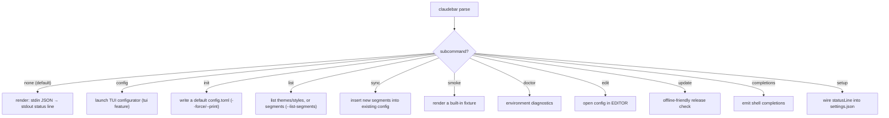

# CLI surface and TOML config

claudebar's operational surface is a single `clap`-derived `Cli` struct
(`src/cli.rs`) dispatched from `src/main.rs`, plus a TOML config file modeled
by `src/model/config.rs`. This page documents every subcommand, the shared
render overrides, and the complete `config.toml` schema. The per-segment
render contracts live in [segments](/openwiki/concepts/segments.md), the
look-and-feel registries in
[themes-and-styles](/openwiki/concepts/themes-and-styles.md), the
`settings.json` wiring in
[claude-code-hook](/openwiki/integrations/claude-code-hook.md), and the
update/version check in
[update-command](/openwiki/operations/update-command.md).

## Dispatch model

Caption: `main()` matches the parsed `Command` and dispatches to a `run_*`
function. `render` is the default — the subcommand is `None` when the user
passes no subcommand, so plain `claudebar` behaves as `claudebar render`.

## The subcommands

`Command` (`src/cli.rs`) enumerates eleven subcommands. `render`, `config`,
`init`, `sync`, `doctor`, `edit`, and `setup` carry the shared render
overrides; `list`, `smoke`, `completions`, and `update` deliberately do not.

| Subcommand | Purpose | Render overrides |
|---|---|---|
| `render` (default) | Read session JSON from stdin, write the ANSI status line to stdout | yes |
| `config` | Launch the interactive TUI configurator (`tui` feature) | yes |
| `init` | Write a default config file, or `--print` it | yes |
| `list` | List built-in themes and styles, or segments with `--list-segments` | no |
| `sync` | Add new segments introduced by newer versions to an existing config | yes |
| `smoke` | Render a built-in fixture to verify the install | no |
| `doctor` | Run environment diagnostics (font, git, config, PATH, statusLine) | yes |
| `edit` | Open the config file in `$EDITOR` (falls back to `vi`), creating it if absent | yes |
| `update` | Check the latest release; never runs during rendering | no |
| `completions` | Generate shell completions | no |
| `setup` | Wire `claudebar render` into Claude Code's `settings.json` `statusLine` | yes |

### `render` — the default hot path

`render` reads **all** of stdin (`InputData::parse` is infallible), resolves
the config, injects the current epoch time, and prints `render_line`'s output
to stdout. When stdin is a terminal it prints a hint telling the user to pipe
session JSON or press Ctrl+D. It always exits `0` — a malformed config warns on
stderr and falls back to defaults (never breaks rendering).

### `config` — the TUI configurator

`config` launches the interactive TUI (`claudebar::tui::run`). This is
feature-gated on `tui`: built without it, the subcommand prints that the
configurator is unavailable, suggests `claudebar init --print`, and exits `1`.

### `init` — bootstrap a config

`init` serializes a default `Config` to pretty TOML. With `--print` it writes
it to stdout and exits; otherwise it writes the file, creating parent
directories, and refuses to overwrite an existing file unless `--force` is
given. Both `init` and `edit` share `default_config_with_font_check`, which
falls back to style `"unicode"` and prints a Nerd Font hint when no Nerd Font
is detected.

### `list` — discover surface

With no flag, `list` prints every built-in theme and style name. With
`--list-segments`, it enumerates the `SegmentKind::ALL` segments in canonical
order as kebab-case names with their human labels, marking each one that is in
the default `SegmentKind::DEFAULT` set with `[default]`.

### `sync` — migrate a config forward

`sync` loads the existing config and inserts every segment present in
`SegmentKind::ALL` but absent from the user's `segments` list at its canonical
position relative to its `ALL`-order neighbors, preserving the user's overall
ordering. With no config file present it reports there is nothing to sync. One
segment is deliberately **not** backfilled: `update-notice` spawns a daily
background network check, so `sync` skips it as opt-in and prints a notice
explaining how to enable it (guarded by `main_sync_leaves_update_notice_opt_in`).

### `smoke` — deterministic install check

`smoke` parses the built-in `fixtures/typical.json`, renders it with
`Config::default()`, and prints the result plus a hint to run `doctor`. It uses
a fixed `now` so the output is deterministic across machines.

### `doctor` — environment diagnostics

`doctor` prints ✓/✗ checks for five conditions: the binary is on `$PATH`, a
Nerd Font is installed, `git` is on `$PATH`, the `config.toml` parses (surfacing
config errors — not silently defaulting), and Claude Code's `settings.json` has
a `statusLine` command containing `claudebar`. It always succeeds (`0`); it is
informational only.

### `edit` — open the config in an editor

`edit` resolves the config path, creates a default config first if the file is
missing (reusing the same font-check bootstrap as `init`), then runs
`$EDITOR` (falling back to `vi`) on it. It exits non-zero if the editor fails
to launch or exits with a non-zero status.

### `update` — offline-friendly release check

`update` compares the installed CalVer version against the GitHub releases API
via `curl` (no HTTP dependency) and is a **manual** command — the render hot
path never touches the network. Exit codes: `0` up to date (or check
succeeded), `1` the check failed, `2` an update is available. With `--check`
it never exits `2`, making it safe in `set -e` shells. `--channel beta` opts
into prereleases; the default `stable` channel compares against the newest
stable release. It deliberately carries **no** render overrides.

### `completions`

`completions <shell>` generates shell completions via `clap_complete` from the
`Cli` command definition.

### `setup` — hook wiring entrypoint

`setup` patches the `statusLine` key of Claude Code's foreign, user-owned
`settings.json` to `{"type":"command","command":"claudebar render"}`. It backs
up a parseable existing file before writing, refuses to overwrite a different
`statusLine` without `--force`, honors `--binary-path` to point at an absolute
install location, and supports `--print` / `--yes` for scripted use. See
[claude-code-hook](/openwiki/integrations/claude-code-hook.md) for the full
flow. On success it prints a live preview rendered through the real CLI config
path.

## Shared render overrides

`Overrides` (`src/cli.rs`) is a `clap`-flattened block of four optional flags
usable both at the top level and on the subcommands that carry it:

- `--config <FILE>` — path to the config file (defaults to
  `$XDG_CONFIG_HOME/claudebar/config.toml`).
- `--theme <NAME>` — theme override for this invocation.
- `--style <NAME>` — style override for this invocation.
- `--segments <SEGMENTS>` — comma-separated kebab-case segment names.

Both `claudebar --theme X` and `claudebar render --theme X` work. The
`Overrides` block is **deliberately not** attached to `update` (and is absent
from `list`, `smoke`, and `completions`), which has no render overrides.

`Cli::effective_overrides` merges the top-level overrides with the resolved
subcommand's overrides **field by field**: whenever the subcommand sets a
field, it wins; fields the subcommand leaves `None` keep the top-level value.
So `claudebar init --config FILE` applies `FILE`, while `claudebar --config
FILE init` also applies `FILE`, and given both the subcommand value wins.

## The TOML config

Config is TOML at `$XDG_CONFIG_HOME/claudebar/config.toml` (falling back to
`$HOME/.config/claudebar/config.toml`). **Config-less operation is a
first-class state**: with no file, `Config::default()` applies — the 8-segment
Tokyo Night Powerline layout. That default layout mirrors the bash statusline's
segment order (`lines` placed between `context` and `rate-limits`), which is
why it deliberately differs from the canonical `SegmentKind::ALL` order; the
parity is guarded by the `default_matches_bash_layout` test.

### Top-level keys

Every struct field carries `#[serde(default)]`, so a partial TOML always
parses and absent keys keep their defaults.

| Key | Default | Meaning |
|---|---|---|
| `theme` | `"tokyo-night"` | theme name (see themes-and-styles) |
| `style` | `"powerline"` | style name |
| `segments` | `SegmentKind::DEFAULT` | ordered list of kebab-case segment names (presence = enabled, order = render order) |
| `thresholds` | `Thresholds::default()` | the numeric/behavioral thresholds object |

`segments` uses serde's `rename_all = "kebab-case"` mapping, so entries are
written as `"rate-limits"`, `"dev-context"`, and so on. The default 8 segments
are `directory, git, model, context, lines, rate-limits, cost, duration`.

### `thresholds` keys

`Thresholds` controls color bands, progress bars, and behavioral toggles.
Defaults (`src/model/config.rs`):

| Key | Default | Meaning |
|---|---|---|
| `warn` | `50` | bar/usage turns warn-colored at or above this percent |
| `crit` | `80` | bar/usage turns crit-colored at or above this percent |
| `weekly_show_at` | `75` | weekly rate-limit window shown once usage reaches this percent |
| `bar_width` | `6` | width, in cells, of every progress bar |
| `cost_decimals` | `2` | decimal places for the cost segment |
| `name_max` | `0` | max chars for project/git/model names before truncation (`0` = off) |
| `clock_mode` | `"auto"` | clock display: `12h`, `24h`, or `off` |
| `model_show_effort` | `true` | Model segment appends the inline effort bar |
| `burn_lookback` | `600` | burn-rate lookback window in seconds (10 min) |
| `float` | `false` | enable the plain-text float readout file (best-effort side effect) |
| `float_segments` | `"model context cost"` | segments rendered into the float readout |
| `float_sep` | `"  ·  "` | separator between adjacent non-empty float segments |
| `float_file` | `"~/.claude/claudebar-float.txt"` | where the float readout is written (`~` expands to `$HOME`) |
| `layout` | `"fixed"` | `fixed` (one line) or `auto` (responsive wrap) |
| `max_lines` | `3` | auto only — max lines to wrap into |
| `wrap_margin` | `4` | auto only — columns kept free on the right |
| `limit_sync` | `false` | cross-session rate-limit sync (opt-in) |

The `render_line` entrypoint applies these: the float readout is emitted as a
best-effort side effect whenever `float` is true (a write failure can never
break the status line), and the `layout` value selects fixed vs auto wrapping
in the shared `render_ctx` layout step used by both `render_line` and
`render_with`.

### Error semantics: `render` vs the rest

`Config::load` treats a **missing file as `Config::default()`** (no error), a
**present-but-malformed file as `ConfigError::Parse`**, and an unreadable file
as `ConfigError::Io`. The two loaders differ in how parse errors surface:

- **`render`** uses `resolve_config`: a malformed file prints a `claudebar:
  warning:` on stderr and falls back to `Config::default()` so the status line
  never breaks.
- **`init`**, **`sync`**, and **`doctor`** surface config errors as real
  failures (they print the error and exit non-zero) instead of silently
  defaulting — the "infallible parse" philosophy applies only to the render hot
  path, not to maintenance commands.

Unknown `--theme`/`--style` names warn and fall back to `tokyo-night` /
`powerline`; unknown `--segments` entries warn and are ignored, and an empty
parsed segment list leaves the config's own list intact.

## Persistence

`Config::save` serializes to pretty TOML, creating parent directories first,
and surfaces `ConfigError::Io` (parent dir / write) and `ConfigError::Parse`
(serialization) failures. `Config::default_path` honors a non-empty
`$XDG_CONFIG_HOME`, falling back to `$HOME/.config`, then joins
`claudebar/config.toml`.

## Focused tests

- `src/model/config.rs` — defaults match the bash layout, partial-TOML
  round-trips, kebab-case segments, malformed-file parse errors vs
  load-or-default fallback, missing-file returns default, save/load round-trip.
- `src/cli.rs` — subcommand arg parsing (`edit`, `init --print`, default
  `Config` serializing to TOML with `tokyo-night`).
- `src/main.rs` — `default_config_with_font_check` picks `unicode` when no
  Nerd Font is detected.
- `tests/cli_main_dispatch.rs` — spawns the binary and asserts exit codes and
  stdout/stderr for `render`, `init`, `list`, `sync`, and the rest, including
  that `sync` adds ordinary segments while leaving `update-notice` off
  (`main_sync_leaves_update_notice_opt_in`).
- `tests/cli_smoke.rs` — the stdin → stdout render contract.
