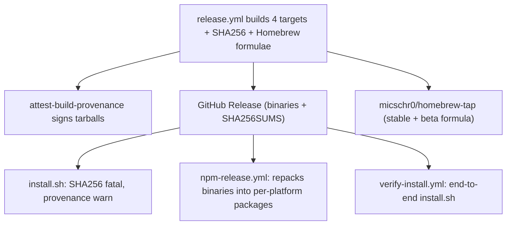

# Installation and distribution (install.sh, npm, Homebrew)

claudebar distributes a single native Rust binary through **four** methods: the
documented `curl | sh` path (`install.sh`), Homebrew (cargo-dist tap), npm/pnpm
per-platform packages, and `mise` (`mise use -g github:micschr0/claudebar`). The
GitHub Release is the single source of the already-built, provenance-attested
binaries; every method repackages those same archives. Every method checks the
SHA256 of the downloaded artifact; only `install.sh` and `mise` additionally
verify build provenance (Homebrew and npm do not). This page documents the installers, their trust/verification
model, and how release channels (stable vs beta) flow to each. For the
authoritative threat model and release-verification procedure for these
channels, see `SECURITY.md` (`repo://SECURITY.md`) — the SHA256 checksum is
mandatory on every channel, and build provenance via `gh attestation verify` is
advisory (and unavailable for Homebrew tap installs and npm).

## Distribution overview

cargo-dist (pinned to `0.32.0` in `[workspace.metadata.dist]`) is the build
engine: it emits the four target archives, a `SHA256SUMS.txt`/`sha256.sum`
checksum file, and the Homebrew formulae that publish to the tap
`micschr0/homebrew-tap`. `release.yml` (dist-generated) builds, releases, signs
provenance, and pushes the Homebrew tap; two downstream workflows
(`npm-release.yml`, `verify-install.yml`) trigger on `release: published`.

Caption: `release.yml` is the single producer; `install.sh`, the npm packages,
and Homebrew all consume the same attestation-signed GitHub Release assets.

## cargo-dist configuration (`Cargo.toml`)

`[workspace.metadata.dist]` owns the release topology:

- **Four targets**, listed explicitly because musl is not in dist's default
  suite: `x86_64-unknown-linux-musl`, `aarch64-unknown-linux-musl`,
  `x86_64-apple-darwin`, `aarch64-apple-darwin`.
- **`installers = ["homebrew"]`** — Homebrew is the only cargo-dist-built
  installer; `install.sh` (repo root) is separate and not built by dist.
- **`publish-prereleases = true`** — lets the same Homebrew job publish a
  prerelease tag into the `@beta` formula (without it, the job's `if:`
  short-circuits prereleases).
- **`checksum = "sha256"`**, **`auditable = true`**, and
  **`unix-archive = ".tar.gz"`** (pinned over dist's `.tar.xz` default to
  preserve the existing release-URL contract that `install.sh` and npm expect).
- **`tap = "micschr0/homebrew-tap"`** with `publish-jobs = ["./homebrew-app-token"]`.
- The ARM macOS build is pinned to `macos-14` via
  `[workspace.metadata.dist.github-custom-runners]`; the Intel macOS and both
  Linux-musl builders use their defaults.

`cargo-dist-version = "0.32.0"` is pinned: the CI guard installs this exact
version so the generated `release.yml` cannot silently drift.

## install.sh — the curl | sh path

`install.sh` is the documented one-command installer, invoked bare over the
network (`curl -fsSL … | bash`), and is also **sourceable** for tests: its
guarded entry point (`[[ "${BASH_SOURCE[0]:-$0}" == "$0" ]]` → `main`) means
sourcing it only defines functions, so bats tests source it and exercise
individual functions directly.

### Channel selection and requirements

- `CLAUDEBAR_CHANNEL` selects the release: `stable` (default) hits
  `/releases/latest`; `beta` hits `/releases` and takes entry `[0]` (newest
  prerelease). Any other value is a fatal error.
- `CLAUDEBAR_TARGET` overrides target-triple detection (used by CI to force a
  specific asset download).
- All downloads go through `curl_https`, which pins `--proto '=https'
  --tlsv1.2` so a redirect or MITM cannot downgrade the connection.
- Dependency check requires `git`, `curl`, and `jq` (each reported with an
  install hint on macOS/Linux); `git` only matters for the git segment, while
  `curl`/`jq` are mandatory for the prebuilt download.

Target detection maps `uname -s`/`uname -m` to the four dist triples
(`arm64`/`aarch64` → `aarch64`), returning nothing for unsupported arches —
which routes to the source-build fallback.

### Trust tiers: SHA256 fatal, provenance warning

The verification model is deliberately two-tiered. `SECURITY.md` is the
authoritative threat model and release-verification doc for these install
channels — the SHA256 checksum is the mandatory integrity gate, while build
provenance via `gh attestation verify` is advisory.

- **Checksum (fatal):** `install.sh`'s `sha256_of` computes the archive's
  SHA256 using `sha256sum` on GNU/Linux or `shasum -a 256` on macOS, then
  `verify_checksum` compares it against the `sha256.sum` release entry,
  accepting both `hash  name` and `hash *name` sum-file formats. A mismatch
  aborts the install (`exit 1`), as does a missing checksum entry. This SHA256
  comparison is the mandatory, fatal gate. `SECURITY.md` confirms it is the
  mandatory integrity check and that provenance is only a defense-in-depth
  layer on top.
- **Build provenance (advisory):** `verify_attestation` runs
  `gh attestation verify … --signer-workflow
  micschr0/claudebar/.github/workflows/release.yml`, scoping trust to the
  release workflow specifically. It is **never fatal** — it skips (reports
  "skipped") when `gh` is absent, too old for the `attestation` subcommand, or
  unauthenticated, and only warns on a verification failure. `--signer-workflow`
  is chosen because `--repo` alone would only prove the attestation belongs to
  this repo, not that `release.yml` signed it.

Download URLs come from the GitHub API response, which is otherwise trusted
blindly; `require_github_host` rejects anything not hosted on `github.com`
(fatal). Both the archive and checksum URLs must pass this gate.

### Extraction and install

- `archive_has_unsafe_paths` rejects archives containing `..` components or
  absolute paths before extraction.
- `extract_archive` uses `tar --no-same-owner --strip-components=1` (the
  `no-same-owner` works around gVisor returning ENOSYS when tar creates a
  directory then opens files in it).
- `install_binary` finds the `claudebar` binary (maxdepth 2), moves it to
  `$HOME/.claude/claudebar`, and `chmod +x`s it.

### Fallback tiers and post-install

`main` tries **Tier 1 (prebuilt)** then **Tier 2 (cargo build)**:

1. If a prebuilt release is found for the detected target, download + verify +
   extract + install it. Any recoverable failure (no release, no asset, no
   checksum file, download failure) falls through to `cargo build`; a checksum
   mismatch, a missing checksum entry, or an untrusted host is fatal
   (`exit 1`).
2. `install_from_source` builds from a nearby checkout (detected via
   `detect_source_dir`) with `cargo build --release` and installs
   `target/release/claudebar`. This requires `cargo`, a `Cargo.toml`, and a
   source dir; otherwise install fails.

After a successful install, `main` runs `"$BIN_DEST" setup --yes --force
--binary-path "$BIN_DEST"` (skipped when `CLAUDEBAR_SKIP_SETUP` is set),
`link_onto_path` (creating a symlink in the first writable canonical bin dir,
defaulting to `~/.local/bin`), and `report_nerd_font` (warns if no Nerd Font is
detected, since the statusline uses powerline glyphs).

## npm / pnpm — per-platform native packages

The npm distribution follows the Biome/esbuild/Tailwind pattern: a thin main
package plus one native binary package per platform.

- **Main package `@micschr0/claudebar`** declares `bin: claudebar →
  ./bin/claudebar.js` and four `optionalDependencies`
  (`@micschr0/claudebar-<platform>`). Its `files` list ships only `bin`.
- **Each platform package** (`@micschr0/claudebar-darwin-x64`,
  `-darwin-arm64`, `-linux-x64-musl`, `-linux-arm64-musl`) is a `package.json`
  with `os`/`cpu` constraints and a single `claudebar` native binary in
  `files`. npm/pnpm select the matching one via `optionalDependencies` +
  `os`/`cpu`.
- **`bin/claudebar.js`** is a thin launcher: it maps `process.platform + '-' +
  process.arch` to the matching platform package, resolves its binary via
  `require.resolve`, and `spawnSync`s it with `stdio: 'inherit'`,
  forward-arguing `process.argv.slice(2)`. Unsupported platforms and a missing
  platform binary both exit 1 with a reinstall hint. No Node runtime or
  postinstall download is required — the binary ships inside the package.

### Publishing the already-attested binaries

`npm-release.yml` runs **after** a GitHub Release is published and repackages
those exact, already-attested binaries:

1. Resolves the tag (from the release event, a manual input, or the latest
   release).
2. `gh release download` fetches the `claudebar-*.tar.gz` assets.
3. Extracts each tarball (`--strip-components=1`) into
   `extracted/<target>/claudebar`.
4. Copies `npm/main` and the four `npm/platforms/*` templates, `sed`-substitutes
   the `0.0.0` placeholder version with the release tag, and copies the
   extracted binary into each platform package (mapping dist target→platform
   dir, e.g. `x86_64-unknown-linux-musl` → `linux-x64-musl`).
5. Smoke-tests the wrapper on the host platform by mirroring a real install
   under `node_modules`, then publishes the four platform packages and the main
   package to the public registry (`NPM_TOKEN`).

The npm/pnpm packages ship the already-attested release binaries unchanged and
carry **no npm registry provenance** — the package would otherwise attest the
repackaging workflow rather than the build (`README.md` explains this). What an
`install.sh` check verifies is the `release.yml` provenance on the binaries
themselves.

## Homebrew tap

cargo-dist generates the Homebrew installer targeting `micschr0/homebrew-tap`.
`release.yml`'s `custom-homebrew-app-token` job (reapplied after `dist
generate`) commits the formula to the tap using a GitHub App token:

- **Stable** releases write `Formula/claudebar.rb`.
- **Prerelease** (`-beta.N`) releases are rewritten by a Python step into
  `Formula/claudebar-beta.rb`: it strips the bottle block (replacing it with
  `bottle :disable`), renames the class to `ClaudebarBeta` (a `@` suffix is
  not a legal Ruby constant), and aborts if the rename substitution count is
  not exactly 1 (guarding against dist template drift).
- The formula is load-tested through `brew info` so a class/filename mismatch
  fails at publish time, not at user install time.
- Stable and beta never share a commit, so `brew upgrade` cannot bounce stable
  users onto beta. Users install `micschr0/tap/claudebar` (stable) or
  `micschr0/tap/claudebar-beta` (prerelease).

## Release channels

Two channels exist across the installers:

| Channel | install.sh (`CLAUDEBAR_CHANNEL`) | Homebrew formula | npm / mise |
|---|---|---|---|
| stable (default) | `/releases/latest` | `micschr0/tap/claudebar` | `@micschr0/claudebar` (same packages); `mise use -g` |
| beta | `/releases` → newest prerelease | `micschr0/tap/claudebar-beta` | npm always publishes the latest release tag |

`mise` (`mise use -g github:micschr0/claudebar`) verifies the SHA256 and build
provenance automatically; Homebrew and npm/pnpm are limited to the SHA256
checksum (provenance is unavailable for tap formulae and repackaged npm
binaries).

The CalVer tag (`YYYY.M.D[-beta.N]`) is the single source of truth shared by
Cargo.toml, the GitHub Release, the Homebrew formula version, and the npm
package version. Prerelease-aware channels (install.sh beta and the beta
formula) track the newest prerelease, while stable tracks only published
stable releases.

## Testing

- `tests/install.bats` sources `install.sh` and unit-tests the pure functions:
  `detect_target` (override and `uname` mapping), release JSON parsing
  (`release_tag`, `find_asset_url`), `require_github_host` (rejects non-https,
  lookalike domains), `verify_checksum` (both sum formats, tampered file,
  missing entry), `verify_attestation` (all skip/fail branches always return 0
  since it is non-fatal by design), archive safety, and `install_from_source`
  guards.
- `verify-install.yml` is the per-target, end-to-end network path. It runs on a
  matrix of the two Linux musl builders (`x86_64-unknown-linux-musl`,
  `aarch64-unknown-linux-musl` on `ubuntu-24.04`) plus macOS Intel and Apple
  silicon (`macos-15-intel`, `macos-15`). Each run downloads into a clean
  `$HOME` with `cargo` stripped from PATH (so a broken prebuilt download cannot
  be silently masked by the `cargo build` fallback — enforced by an explicit
  `command -v cargo` guard), and it invokes `install.sh` twice: once piped via
  stdin (`cat install.sh | bash`, matching the documented `curl | bash` and
  catching unbound-variable bugs that only surface without a source file) and
  once normally (`bash install.sh`). It asserts the installed binary is
  executable and smoke-runs `--version` and `render` where the host arch
  matches (an aarch64 binary can't execute on an x86_64 runner, so
  `CLAUDEBAR_TARGET` only proves the matching asset downloads, verifies, and
  extracts; `CLAUDEBAR_SKIP_SETUP=1` avoids running setup on the arm64 run).
- `npm-release.yml` smoke-tests the wrapper by mirroring a real install under
  `node_modules` before publishing.

## Related

- [CLI surface and config](/openwiki/operations/cli-and-config.md) — the
  `setup`, `doctor`, and `update` subcommands invoked post-install
- [Releasing](/openwiki/operations/releasing.md) — CalVer tags, release
  preparation, and the workflow that produces these artifacts
- [`SECURITY.md`](repo://SECURITY.md) — the authoritative threat model and
  release-verification procedure (SHA256 mandatory, provenance advisory) for
  these install channels
- [Update command](/openwiki/operations/update-command.md) — the offline
  release-check behavior of `claudebar update`
- [Quickstart](/openwiki/quickstart.md) — install instructions and repo layout
- [Testing overview](/openwiki/testing/overview.md) — the bats suite
  (`tests/install.bats`) that covers `install.sh`
