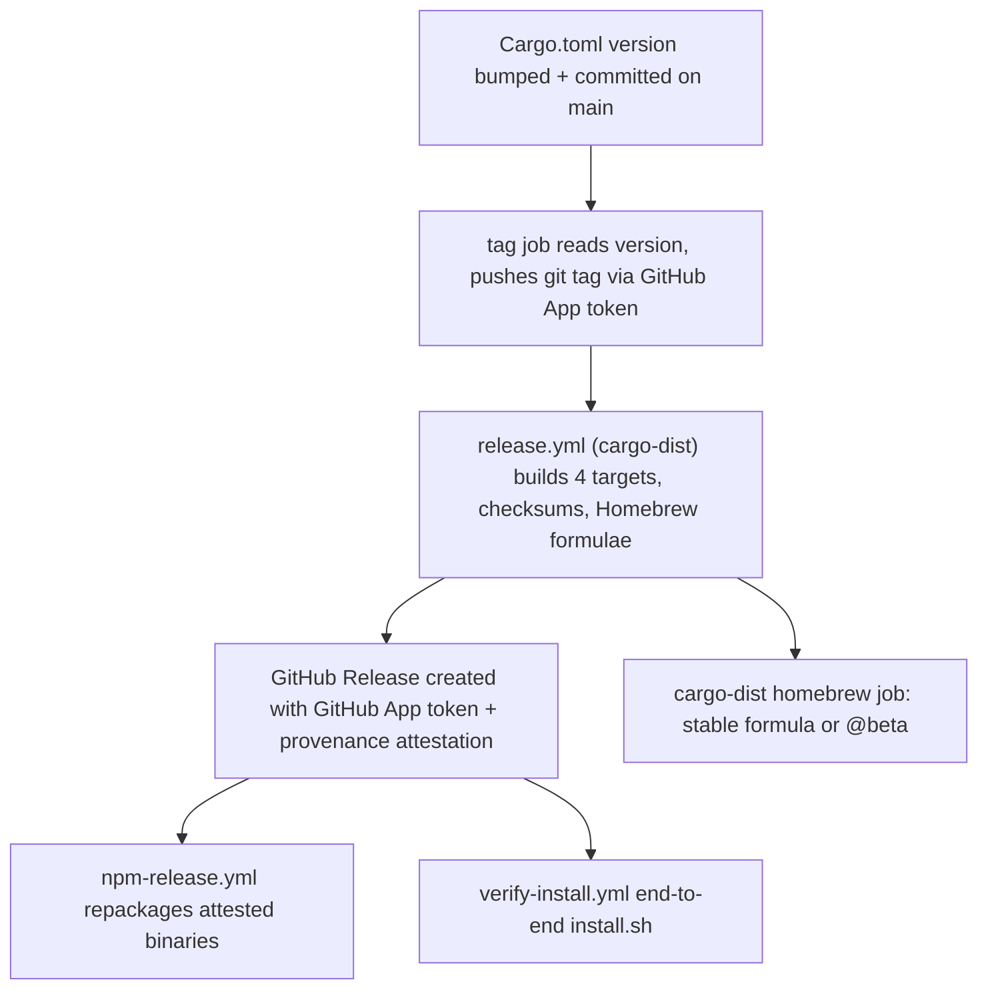

# Releasing: CalVer version model and CI pipeline

claudebar cuts releases with a **version-first CalVer model**: the `[package]
version` in `Cargo.toml` is the single source of truth, a tag push drives a
`cargo-dist`-generated pipeline that builds and publishes GitHub Releases, and
two downstream workflows repackage the already-attested binaries into npm and
verify `install.sh` end-to-end. This page documents how a release moves from a
manifest bump to published artifacts.

## Version model: Cargo.toml is the source of truth

The release version lives in exactly one place: `Cargo.toml` `[package]
version` (currently `2026.8.27`). `cargo-dist` reads the version from the
manifest and **requires the pushed git tag to equal it byte-for-byte**; a tag
that disagrees with `Cargo.toml` fails the release. There is deliberately no
`cargo set-version` CI step that derives the version from the tag — the
manifest is bumped *before* tagging (`RELEASING.md` §1).

The format is **digit-first CalVer**, `YYYY.M.PATCH` with no leading zeros
(e.g. `2026.6.24`): `2026.06.25` is invalid semver and breaks both the Cargo
manifest parse and the `dist` tag/version match. The tag has **no `v` prefix**.
The release trigger glob `'**[0-9]+.[0-9]+.[0-9]+*'` in `release.yml` matches
this digit-first tag, and `git-cliff`'s `tag_pattern` in `cliff.toml`
(`[0-9]+\.[0-9]+\.[0-9]+(-[a-zA-Z]+\.[0-9]+)?`) recognizes the same shape
including optional `-beta.N` suffixes.

Caption: `Cargo.toml` is the single version source; the `tag` push runs
`release.yml`, whose published Release fans out to npm and `install.sh`
verification.

## release-prep.yml — the automated release ritual

`.github/workflows/release-prep.yml` automates cutting a release in two phases,
sharing one GitHub App token (`RENOVATE_APP_ID`/`RENOVATE_PRIVATE_KEY`) for all
write access (the workflow's top-level `permissions: {}` is deny-all):

- **`prepare` (manual dispatch, default `version` is today's CalVer)** opens a
  `chore(release): <version>` PR containing exactly three files: the
  `Cargo.toml` version bump, the synced `Cargo.lock` (resolved with
  `cargo metadata`, never compiled), and a new `CHANGELOG.md` section generated
  by `git-cliff` and spliced below the `<!-- next-release -->` marker. It
  validates the version against the CalVer regex (rejecting leading zeros and
  already-existing tags). Historical changelog entries are never regenerated.
- **`tag` (fires on any push to `main` touching `Cargo.toml`)** reads the
  version from the manifest and pushes the matching git tag **with the GitHub
  App token**, because a tag pushed with `GITHUB_TOKEN` would not trigger
  `release.yml` (GitHub loop prevention — see `release.yml`'s comment).
  If the tag already exists it is a no-op.

The PR body of the release PR comes from the CHANGELOG, not from `git-cliff`
directly at PR time — the merged commit is tagged, and the tag run of
`release.yml` makes `dist` autodetect `CHANGELOG.md` and use the
`## [<version>]` section as the GitHub Release body. `cliff.toml` excludes
`chore` commits entirely (the overwhelming majority being Renovate dependency
bumps, which are not user-facing for a statusline renderer).

Merging the PR (a bare `git push` of the version bump to `main` is enough) then
runs `release.yml` exactly as a manual tag would. For stable releases,
`release-prep.yml`'s `git-cliff` roll-up spans every commit since the last
stable tag (not since the last beta), so intermediate betas aren't dropped.

A manual fallback is documented in `RELEASING.md`: bump `Cargo.toml`, sync
`Cargo.lock` with a cargo command (a stale lockfile fails `dist`'s locked
build), splice a `git-cliff --unreleased --tag <ver> --strip all` section below
the `<!-- next-release -->` marker, tag the byte-exact version, and push both
the commit and tag.

## release.yml — the cargo-dist build and publish pipeline

`.github/workflows/release.yml` is **generated by `cargo-dist`** (pinned to
`0.32.0` in `[workspace.metadata.dist]`). It declares `permissions: {}` at the
top and grants write scopes only where a job needs them. Its jobs:

- **`plan`** runs `dist host --steps=create --tag=<tag>` (or `plan` on PRs) and
  publishes the computed manifest; it installs `dist` 0.32.0 and caches it so
  later jobs reuse the exact binary.
- **`build-local-artifacts`** (matrix across the four targets) and
  **`build-global-artifacts`** build/package the platform binaries and the
  universal installers.
- **`host`** does the release itself: it uploads assets, runs
  `actions/attest-build-provenance` to sign the `claudebar-*.tar.gz` archives
  with SLSA provenance, then **creates the GitHub Release with a GitHub App
  token** (`create-github-app-token`) so the `release: published` event fires
  downstream — a `GITHUB_TOKEN`-created release would not. It also prunes every
  older prerelease tag except the newly published one.
- **`custom-homebrew-app-token`** publishes the cargo-dist Homebrew formulae to
  the `micschr0/homebrew-tap` tap: a stable release lands in `claudebar.rb`,
  a prerelease is renamed to `claudebar@beta.rb` (with the `bottle` block
  stripped). It refuses to clobber a half-downloaded formula and fails on
  class/filename drift so a broken formula never reaches users.
- **`announce`** runs after the host and homebrew jobs succeed, gated with
  `always()` so a skipped prerelease Homebrew publish doesn't block it.

Two comments in the file spell out maintenance invariants: the release-creation
and Homebrew jobs **must be reapplied after every `dist generate`**, and both
use the GitHub App tokens precisely so downstream workflows trigger. The
`release.yml` assets are the four `claudebar-<target>.tar.gz` archives (named
by target only — the version segment is omitted), per-archive `.sha256` files,
and the unified `sha256.sum`; `install.sh`, npm, and Homebrew all consume the
same provenance-attested Release assets.

### Drift guard (CI)

`rust.yml` installs the exact pinned `cargo-dist@0.32.0` and runs
`dist generate --check`, which fails if `.github/workflows/release.yml` has
drifted out of sync with `[workspace.metadata.dist]` in `Cargo.toml`. Because
the pinned dist version is what actually runs the pipeline, the CI can't
silently drift from the release config. The same drift check (`dist generate
--check`) and `dist plan` are the local pre-flight commands in `RELEASING.md`;
a throwaway smoke tag is the end-to-end verification that real archives,
checksums, `--version` output, and `install.sh`'s checksum verification all
work, after which it's torn down.

## npm-release.yml — repackaging the attested binaries

`.github/workflows/npm-release.yml` runs **after** a GitHub Release is
published (`on: release: published`, or manual dispatch with a `tag` input). It
does *not* rebuild binaries — it downloads the already-attested
`claudebar-*.tar.gz` assets from the Release, extracts them, strips the
cargo-dist `claudebar-<target>/` nesting prefix, and assembles the publishable
packages from the checked-in `npm/` templates:

- `npm/main` becomes `@micschr0/claudebar`, a thin launcher whose
  `optionalDependencies` point at the four per-platform packages.
- Each of `darwin-x64`, `darwin-arm64`, `linux-x64-musl`, `linux-arm64-musl` is
  populated with its stripped native `claudebar` binary (the Biome /
  esbuild / Tailwind optionalDependencies pattern).
- The template version placeholder `0.0.0` is substituted with the release tag
  across every `package.json`, and the packages are published to npm with the
  `NPM_TOKEN` secret (platform packages first, then the main package).

A host-platform smoke test mirrors a real install before publishing: it
constructs the `linux-x64-musl` optionalDependency in place and runs
`node "$pkg/bin/claudebar.js" --version`.

## verify-install.yml — end-to-end install.sh against real assets

`.github/workflows/verify-install.yml` triggers on `release: published` (or
manual dispatch) and runs `install.sh` against the just-published release
assets in a **clean HOME** (`$RUNNER_TEMP/verify-home`) across a matrix of the
two Linux-musl targets and both macOS architectures. To force the Tier 1
prebuilt download it strips `cargo`/`.cargo/bin` from `PATH` so a broken
prebuilt can't be silently masked by falling through to `cargo build` (Tier 2);
it checks `cargo` is truly gone and then exercises both the piped-stdin
`cat install.sh | bash` path (the documented `curl | bash` usage) and the
sourced path, verifying the installed `$HOME/.claude/claudebar` is executable,
reports `--version`, and renders `{}`.

## Related workflows

- **`rust.yml`** — fmt, clippy across **both** feature sets (`--all-features`
  and `--no-default-features` disabled-TUI), tests, the release-profile
  auditable build, the pinned `dist generate --check` drift guard, plus PR
  coverage reporting.
- **`security.yml`** — shellcheck + actionlint + bats (in the actionlint
  container) + semgrep + cargo-audit + gitleaks + zizmor.
- **`renovate.yml`** — scheduled (03:00 UTC) Renovate run on `renovate.json`
  using the GitHub App token; its `chore(deps)` commits are the bulk of what
  `cliff.toml` filters out of the changelog.
- **`benchmark.yml`** — the Performance SLO check (`scripts/benchmark.sh`).
- **`pages.yml`** — deploys the `docs/` site to GitHub Pages.
- **`openwiki-update.yml`** — scheduled (08:00 UTC) `openwiki code --update`
  run that opens an `openwiki/update` PR.

Version and channel details shared with the installers are documented in
[installation-and-distribution](/openwiki/operations/installation-and-distribution.md);
the release-channel model feeds the `claudebar update` command documented in
[update-command](/openwiki/operations/update-command.md), and the CI/test
surface is covered in [testing](/openwiki/testing/overview.md).
