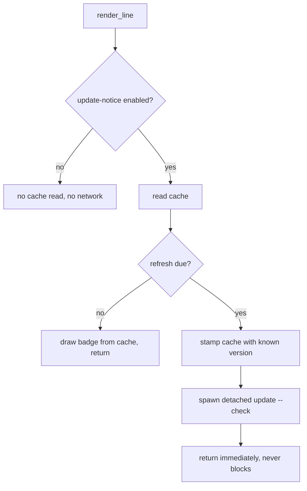

# Update command and release channels

claudebar ships a manual, user-triggered update check (`claudebar update`) rather
than any implicit network activity during normal rendering. The command is
implemented in `src/update.rs` (version model + release fetch + comparison +
cache) with the CLI wiring and exit-code handling in `src/main.rs`, and its
subcommand declaration in `src/cli.rs`.

## Design intent: the render hot path stays offline

Updating is a **deliberate design choice**: the render hot path never touches the
network, and the statusline hook stays offline and fast. `claudebar update` is an
explicit command with its own exit codes so a script or a user can find out
whether a newer release exists and how to install it. The CLI subcommand
documentation repeats this — it is "a manual, offline-friendly check" that never
runs during normal rendering.

The same principle governs the `update-notice` segment: the render path may read
a cached result, but it never performs a network call itself — a detached child
process does that in the background, at most once a day (see below).

## Version source and channel model

The version source is the **GitHub releases API** (`releases?per_page=30`) — the
same channel that `install.sh` and the Homebrew tap publish to. Since claudebar
ships prereleases (CalVer `...-beta.N`) on a separate channel, the comparison is
**channel-aware**:

- By default (`stable`), it compares against the newest **stable** release (the
  default install path).
- Prereleases are only offered when the user opts in with `--channel beta`.

The command takes two flags:

- `--check` — never exits `2` for "update available"; always exits `0` on success,
  so it is safe inside `set -e` shells and `&&` chains. The result is still printed
  on stdout.
- `--channel` — a `clap` value enum defaulting to `stable` (`Channel::Stable` /
  `Channel::Beta`), displayed as `"stable"` / `"beta"`.

## Exit codes

The documented, script-usable convention:

- `0` — up to date (or, with `--check`, the check succeeded)
- `1` — could not check (network / parse error)
- `2` — an update is available (only without `--check`)

When a check fails, `fetch_latest` surfaces a message and `run_update` prints a
hint ("ensure `curl` is installed and you are online") plus a usage link, then
returns `ExitCode::FAILURE` (1). When an update is available and `--check` is not
set, it returns `ExitCode::from(2)`; the `--check` path always returns success.

## Control flow

<!-- openwiki: mermaid parse failed and this diagram was converted to a text fence so it does not break rendering. Fix the diagram source and restore the mermaid fence. Parser error: Heuristic: a semicolon inside a label breaks rendering; rephrase the label. -->
<!-- openwiki: mermaid parse failed and this diagram was converted to a text fence so it does not break rendering. Fix the diagram source and restore the mermaid fence. Parser error: Heuristic: an unescaped angle bracket inside a label breaks rendering; rephrase the label. -->
```text
flowchart TD
    A["run_update check channel"] --> B["parse CARGO_PKG_VERSION"]
    B --> C{"installed parses?"}
    C -- no --> D["error unknown installed version, exit 1"]
    C -- yes --> E["fetch_latest via curl"]
    E --> F{"fetch parse ok?"}
    F -- no --> G["print hint plus usage link, exit 1"]
    F -- yes --> H["recommend installed latest channel"]
    H --> I{"current >= target?"}
    I -- yes --> J["print up-to-date, exit 0"]
    I -- no --> K["print update available version"]
    K --> L{"check set?"}
    L -- yes --> M["exit 0"]
    L -- no --> N["exit 2"]
```

Caption: the `claudebar update` decision flow — parse the installed version,
fetch/parse releases, compare channel-aware, and map the outcome to an exit code.

## Fetching and parsing releases

`fetch_latest` shells out to `curl` (the same tool `install.sh` relies on) rather
than pulling in an HTTP dependency — acceptable because the render hot path never
calls this code. It runs:

```text
curl --fail --silent --show-error --location --max-time 15 \
  https://api.github.com/repos/micschr0/claudebar/releases?per_page=30
```

Failure semantics:

- If `curl` cannot be spawned, exits non-zero, or times out, it returns
  `UpdateError::Network`.
- If the body is not a JSON list of releases, or contains no parseable CalVer tag,
  it returns `UpdateError::Parse`.

Each release entry only needs its `tag_name`. All parseable tags are collected
into `Version`s, then `Latest` is derived:

- `overall` — the newest release across all channels (stable and prerelease).
- `stable` — the newest stable (non-prerelease) release, if any.

## CalVer version model and semver ordering

Versions are CalVer with an optional `-beta.N` prerelease suffix, e.g.
`2026.8.15` or `2026.8.15-beta.1`. `Version::parse` accepts exactly `N.N.N` with
an optional `-prerelease` suffix; anything with more than three numeric
components, or garbage, parses to `None` (so `2026.8` and `a.b.c` fail).

Ordering follows **semver semantics**:

- `major`, then `minor`, then `patch` are compared numerically.
- Within the same `major.minor.patch`, a release beats any prerelease.
- Prereleases compare field-by-field via their `beta.N` numeric level
  (`beta.1` < `beta.2`).

The prerelease comparator is deliberately simple: it only handles the
`-beta.<u32>` shape claudebar uses. A release always sorts higher than a
prerelease of the same version; a newer minor beats an older minor even when the
older minor carries a beta (e.g. `2026.8.15-beta.1` > `2026.7.21`).

## Channel-aware recommendation

`recommend(current, latest, channel)` decides the outcome:

- On `Stable`, the target is `latest.stable`, falling back to `latest.overall` if
  no stable release exists yet.
- On `Beta`, the target is `latest.overall`.

If `current >= target`, the result is `UpToDate`; otherwise `Update` carries the
target `version`, an `is_beta` flag, and the newest stable release as context.

Key behavioral tests pin this down:

- A Stable-channel user installed at the newest stable is told they are up to
  date even when a newer prerelease exists.
- A real newer stable release is still offered on the Stable channel.
- The Stable channel falls back to the newest overall release when no stable
  release exists.
- On the Beta channel, an installed prerelease at the newest release is up to
  date.

## Output

`run_update` prints the installed version and channel, then either "You are on
the latest {channel} release." or "Update available: {version} (stable|prerelease)",
plus the latest stable release as context and an installation link. For a
prerelease it adds a note that staying on the stable channel avoids prereleases.
The recommended install target is the GitHub installation page.

## Background refresh: the update-notice cache

So the statusline can show "a newer release exists" without ever blocking on the
network, `claudebar update` writes a small JSON cache that the `update-notice`
segment later reads. The cache lives at `update-check.json` beside the config
file (so XDG resolution stays in one place) and is written atomically through the
float readout's `write_atomic`; a torn read degrades to "no cache".

`run_update` maintains the cache on both outcomes:

- On success, the cache records `latest.stable` — **always the newest stable
  release, independent of the channel this invocation reported on**. Caching
  `overall` here would badge stable-channel users toward a prerelease; when no
  stable release exists at all, nothing is recorded.
- On a failed fetch, `run_update` still stamps the cache with the current time
  and the already-cached newest version (`write_cache` with the known version).
  That backoff means a background refresh retries a day later rather than on
  every render — and dropping the cached version would blank the badge on every
  machine that happens to be offline when the daily refresh fires.



Caption: how the `update-notice` segment stays offline — the render reads the
cache and, when a daily refresh is due, spawns a detached child to do the network
check, then returns without waiting.

`render_line` drives this: when the `update-notice` segment is enabled it reads
the cache once, calls `update::refresh_in_background`, and renders from the value
it already has — a single cache read feeds both jobs, so the badge stays current
without the render ever blocking on the network.

`refresh_in_background` is the gate:

- A check is due only when there is no cache, or the cache is older than a day
  (`REFRESH_INTERVAL` = 86400 s). A stamp in the future yields a negative age
  that never exceeds the interval, so clock skew suppresses checks until wall
  time catches up.
- Before spawning, it **claims the rate-limit slot** by re-stamping the cache
  (keeping the already-known version), so the badge survives the claim and a
  15-second `curl` doesn't let every later render spawn its own check. The child
  is the current binary invoked as `update --check`, with stdin/stdout/stderr
  nulled, and the caller never waits on it or sees its output.
- If there is no usable cache path, or the cache cannot be written, nothing is
  spawned at all — without a writable cache there is no way to rate-limit, so a
  daily check is safer than a per-render one.

The `update-notice` segment itself is a pure formatter: it shows `↑ {version}`
when the cached newest release is strictly newer than the running binary, and
renders nothing when `ctx.update` is `None`, so it does no I/O of its own.

Because it is the one segment that spawns a daily network check, `update-notice`
is **opt-in**: the `sync` command reports it instead of enabling it, keeping a
network-touching segment out of anyone's config unless they explicitly ask.
