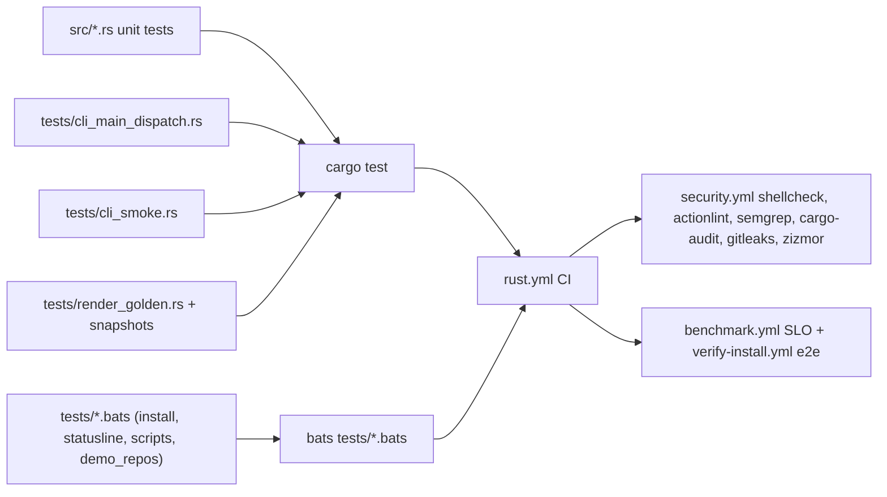

# Testing strategy

claudebar layers its tests so a change can be validated narrowly: Rust unit
tests inside each module, integration tests over the CLI dispatch surface,
deterministic insta golden snapshots over `fixtures/`, and bats shell suites for
`install.sh`, `statusline-command.sh`, the `scripts/` tooling, and the demo
repos. CI (`rust.yml` + `security.yml` + `verify-install.yml` + `benchmark.yml`)
runs the whole stack on every push/PR.



Layered strategy: unit per module → CLI integration → golden snapshots → bats
suites → CI + coverage + SLO.

## Rust unit tests

Every module carries a `#[cfg(test)] mod tests` block that exercises the
pure-logic surface directly: parsers in `src/model/`, segment formatters in
`src/segment/`, the render pipeline in `src/render/`, theme/style tables in
`src/themes/` and `src/styles/`, control-byte/ANSI sanitization in
`src/sanitize.rs`, and config/feature logic in `src/cli.rs`. Two invariants are
broadcast across all segments:

- `every_kind_resolves_and_renders_empty_input` in `src/segment/mod.rs` walks
  `SegmentKind::ALL` and demands each variant resolve to a `as_segment()`
  implementation and render against `InputData::default()` without panicking —
  a new segment that is never wired up, or that panics on missing data, fails
  here.
- `every_segment_kind_has_help_text` in `src/tui/app.rs` walks the same
  `SegmentKind::ALL` and asserts each variant has a non-empty
  `segment_help(kind)` line that names the segment — so a new variant cannot
  ship an empty description in the configurator.

An intentionally low-coverage area is documented in `CONTRIBUTING.md`: the TUI
drawing shell (`src/tui/mod.rs`, `src/tui/ui.rs`, `src/tui/preview.rs`) sits at
0% because it depends on ratatui's terminal primitives that need a `TestBackend`
harness. That does **not** extend to `src/tui/app.rs`: the whole `src/tui/`
module is gated behind the `tui` feature in `src/lib.rs`
(`#[cfg(feature = "tui")] pub mod tui;`), and `app.rs` is kept free of ratatui
draw calls precisely so its `App`-state logic can be unit-tested. `app.rs`
carries real `#[cfg(test)]` tests that run under `--all-features`:
`save_clears_dirty` — `save()` writes the config to `save_path` and only clears
the dirty flag (synchronizes `saved_config`) after a successful write, leaving
`status` set with a success/error/warning message on every branch;
`reset_restores_defaults_and_cursors` — `reset()` restores `Config::default()`
and clears dirty; plus toggle/reorder/threshold/toggle-cursor tests that keep
`App` state coherent.

Segment tests also cover the failure path: `git_unavailable_returns_false` in
`src/segment/git.rs` mocks an empty `PATH` via raw env mutation (restoring it
afterwards) and asserts `Git.render` returns `false` — the safe, no-panic
fallback — when the `git` subprocess cannot spawn, complementing the
parse-status unit tests that never invoke a process. Anything touching a segment
or the render layer is expected to cover new branches in the matching
`#[cfg(test)]` block.

## Integration: CLI dispatch

`tests/cli_main_dispatch.rs` spawns the real `claudebar` binary via
`env!("CARGO_BIN_EXE_claudebar")` and asserts exit codes plus expected
stdout/stderr for each subcommand path — `render` (with and without stdin
input), `init` (`--print` and force-write), `list`/`--list-segments`, `sync`
round-trip including the opt-in `update-notice` segment, `doctor`,
`completions`, `help`, `version`, and graceful `config` behavior (which may
report being built without the `tui` feature). `tests/cli_smoke.rs` is a lighter
contract check: pipe fixture data into `render`, assert exit-0 and non-empty
output, and confirm the `smoke` subcommand succeeds. The pre-existing clap
debug-assertion bug (a conflicting `--segments` long flag) was fixed in
`src/cli.rs` by renaming the List-subcommand flag to `--list-segments` so these
dispatch tests run cleanly with exit code 0 in debug builds.

## Golden snapshots

`tests/render_golden.rs` is the determinism anchor. `golden_lines` renders every
`fixtures/*.json` through the default config (Tokyo Night + Powerline) with a
fixed clock (`FIXED_NOW = 1_899_990_000`, just before the fixtures' far-future
`resets_at` epochs so countdowns are present and stable) and a fixed
`$HOME = /home/me`, then turns ESC bytes into the literal `\e` for readable
diffs and insta snapshots the full line. `golden_matrix` renders
`fixtures/typical.json` across every theme × {ascii, powerline} (16 × 2 = 32
snapshots) under distinct `{name}__{style}` suffixes so they never collide with
the `golden_lines` glob outputs. `golden_dots_style` gives the `dots` style one
explicit snapshot (`render_golden__golden_dots_style.snap`), since neither
`golden_lines` (default style) nor `golden_matrix` (ascii/powerline) covers it.

Fixture `cwd` values point at non-existent paths, so the git subprocess fails
and **no git segment appears** — this keeps every golden snapshot independent of
the checkout's own git state. `injection_no_control_byte_leak` renders
`fixtures/injection.json` (whose `cwd`/model carry ESC/BEL/CR/LF), strips only
the renderer's own SGR runs, and asserts no host-supplied control byte remains —
explicitly anchoring the `sanitize::strip_control` contract. `golden_ultra_effort`
and `render_fixed_emits_full_pipeline` cover maximum-coverage inputs.

Snapshots live in `tests/snapshots/` and are updated with either:

```sh
cargo insta review   # review pending snapshots
# or
INSTA_UPDATE=always cargo test      # "task test-update" (Taskfile)
```

Running `cargo test` (Taskfile `test-update`) with `INSTA_UPDATE: always`
rewrites snapshots. In CI, `INSTA_UPDATE: no` is set so `cargo test` fails
rather than silently rewriting snapshots on unexpected output.

## Bats suites

The shell layer is covered by four bats files run together via
`bats tests/*.bats` (CI installs `bats` and `jq`):

- **`tests/install.bats`** — sources `install.sh` directly and exercises
  individual functions, because the script guards its entry point: `main` only
  runs when the file is executed, not sourced, so sourcing is side-effect free.
  It covers `detect_target` (target override and OS→triple mapping),
  release-JSON parsing (`release_tag`, `find_asset_url`), `require_github_host`
  (rejects non-GitHub, plain-http, and lookalike domains), `verify_checksum`
  (text/binary modes, tampered file, missing entry), `verify_attestation`,
  archive safety (`archive_has_unsafe_paths`, `extract_archive` rejecting
  traversal), and `install_from_source` guards. `verify_attestation` is always
  non-fatal by design (status 0 on every branch — gh missing, too old,
  unauthenticated, verified, or failed), asserted explicitly because a
  regression returning 1 would otherwise be masked by the SHA256 gate. The
  networked happy path is covered by `verify-install.yml`.
- **`tests/statusline.bats`** — smoke-tests `statusline-command.sh` against the
  fixtures (empty, typical, over-100% context, 5h/weekly rate-limit, effort,
  injection, no-git) and adds the edge cases CI's smoke never covered (malformed
  JSON, empty stdin, wrong-typed fields); it skips when `jq` is not installed.
  The injection test proves the script only ever emits 256-color `[38;5;...m`
  sequences — the 16-color `[31m`/`[5m` codes the fixture tries to smuggle in
  are absent because the ESC bytes were stripped.
- **`tests/scripts.bats`** — `bash -n` syntax checks for `scripts/benchmark.sh`,
  `gen-gallery.sh`, and `gen_terminal_gifs.sh`, plus `gen-gallery.sh`'s fail-fast
  guards (missing binary, no themes parsed). The `benchmark.sh` runtime (SLO
  timing, flaky under CI load) and `gen_terminal_gifs.sh` runtime (needs
  asciinema/agg/tmux/Nerd Fonts) are intentionally not exercised here — the
  benchmark runs in `benchmark.yml` instead.
- **`tests/demo_repos.bats`** — asserts the deterministic git-state contract
  that `scripts/make_demo_repos.sh` produces for README screenshots: per-repo
  branch name, ahead/behind counts, and modified/untracked tallies (`demo-app:
  main ↑2 M1 ?1`, `demo-busy: feature/render-cache ↑3 ↓1 M4 ?2`, …). It runs the
  idempotent script once in `setup_file` and asserts the states hold on re-run.

## CI

`rust.yml` (Ubuntu, `stable`, mold linker) enforces, with `--locked`:

```sh
cargo fmt --all --check
cargo clippy --all-targets --all-features -- -D warnings
cargo clippy --no-default-features -- -D warnings     # render-only build
cargo test --all-features                             # INSTA_UPDATE: no
cargo test --no-default-features                      # render-only test run
```

The `--no-default-features` runs verify the render-only build (no TUI), since
the `tui` feature gates `ratatui`/`crossterm`/`ansi-to-tui` and, via
`src/lib.rs`, the whole `src/tui/` module. The same job runs an auditable
release build (`cargo auditable build --release --locked`), installs
cargo-dist (`dist generate --check` for workflow drift), runs
`cargo llvm-cov` (`--all-features`), generates `lcov.info` + HTML, and posts a
per-PR coverage summary and line annotations via `scttnlsn/covrs`; the HTML
report is uploaded as an artifact. A separate `build-matrix` job `cargo check
--release` across Linux/macOS targets (x86_64/aarch64).

`verify-install.yml` runs `install.sh` end-to-end in a clean `$HOME` with
cargo/rustc stripped from PATH (so a broken prebuilt download cannot be silently
masked by falling through to `cargo build`), including piped-stdin execution
(`cat install.sh | bash`) that matches the documented `curl | bash` usage and
catches unbound-variable bugs that only surface without a source file. It runs
on release publications and via `workflow_dispatch`, over a Linux
(x86_64/aarch64 musl) and macOS matrix, asserting `$HOME/.claude/claudebar`
exists and that `--version` and `echo '{}' | claudebar render` succeed (only
when the runner arch can execute the downloaded binary).

`security.yml` adds ShellCheck (`-S warning` over install.sh,
statusline-command.sh, scripts/*.sh), actionlint over `.github/workflows/*.yml`
(with the same severity floor so `run:` blocks are held to one standard), the
bats suite (`bats tests/*.bats`), semgrep (trailofbits rules over `*.sh` with
`--error`), `cargo audit`, gitleaks (with `.gitleaks.toml`), and zizmor
(pedantic persona, online audits). `benchmark.yml` runs the performance SLO via
`scripts/benchmark.sh` and uploads a report artifact.

## Coverage discipline

The baseline is ~74% via `llvm-cov`. `covrs` soft-annotates newly added lines —
there is no project-wide `--fail-under-lines` threshold, but PRs must not regress
the total by more than 1 percentage point without noting why. TUI files at 0%
are by design.

## What to watch out for

- Golden snapshots must stay deterministic — the fixed `now`/`$HOME` injection
  is the mechanism; any new time- or environment-dependent output would break
  them.
- Fixture `cwd` pointing at non-existent paths is what suppresses the git
  segment; don't "fix" a fixture to a real path or snapshots will become
  checkout-dependent.
- New segment behavior → unit tests in the segment's `#[cfg(test)]` block plus a
  golden snapshot; also satisfy the two cross-segment invariants
  (`every_kind_resolves_and_renders_empty_input` and
  `every_segment_kind_has_help_text`). Bash fallback changes → `statusline.bats`;
  `install.sh` changes → `install.bats` (keep the entry-point guard so sourcing
  stays side-effect free).
- New `App`-state logic in `src/tui/app.rs` → add a unit test in that module
  (keep it free of ratatui draw calls so it stays testable under
  `--all-features`); a process-spawn fallback in a segment → a test like
  `git_unavailable_returns_false` that mocks `PATH`.
- `INSTA_UPDATE: no` in CI means snapshot drift fails the build on purpose.
